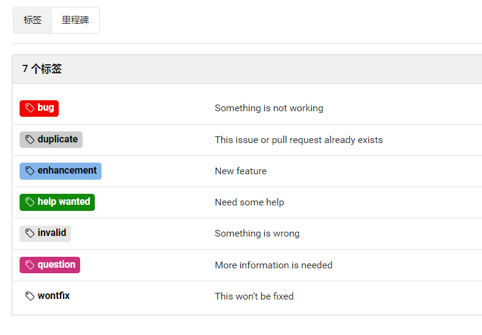
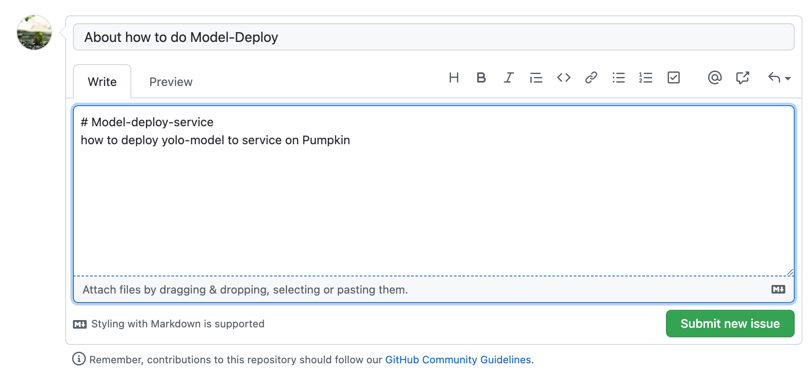

#  Issue模板及开发流程

## issue提交注意事项

- 在提交issue之前，请经过充分的搜索，确定该issue不是通过简单的检索即可以解决的问题。
- 查看issue列表，确定该issue不是一个重复的问题。
- 新建一个issue并选择您的issue类型。
- 使用一个清晰并有描述性的标题来定义issue。
- 根据模板填写必要信息。
- 在提交issue之后，对该issue分配合适的标签。如：bug，question，discussion等。
- 请对自己提交的issue保持关注，在讨论中进一步提供必要信息。

## issue提交规范

### 创建一个好issue的约定：

- 避免使用术语或晦涩的文字
- 问题可以切分，也就是说可以逐步解决的问题
- 尽量跟其他问题没有瓜葛，依赖其它问题会降低处理的灵活性
- 可以协商，也就说我们有好几种办法达到目标
- 问题足够小，可以非常容易的评估出所需时间和资源
- 可衡量，我们可以对结果进行测试

### Labels 标签

针对该issue选取合适的标签。Yunqiic/pumpkin当前提供如下标签供选取：



### Issue Title 格式规范

格式：英文中括号 + 具体模块代码 + title描述

实例：[server/base-server] About how to do Model-Deploy

解释：[server/base-server]就是Pumpkin中的base-server的模块，英文中括号括起来。后面写上issue的主要描述，具体的撰写内容，可以在md文件中详细说明即可。社区支持文件上传和拖拽上传，便于上传更多内容。示例如下:




## 开发流程

**1. Fork分支到本地，设置upstream**

- 从Yunqiic/pumpkin的repo上fork一个分支到您自己的repo来开始工作，并设置upstream为Yunqiic/pumpkin的repo。

```shell
git remote add upstream https://git.yunqiic.org.cn/Yunqiic/pumpkin.git
```

**2. 选择issue**

已有的issue上开发：

- 请在选择您要修改的issue。
- 在选中相关的issue之后，请回复以表明您当前正在这个issue上工作。并在回复的时候为自己设置一个deadline，添加至回复内容中。
- 在开发者列表中找到一个导师，导师会在设计与功能实现上给予即时的反馈。

新的issue:

- 查看历史上的issue能否解决你的问题，进行issue搜索
- 如果是您新发现的问题或想提供issue中没有的功能增强，点击 New issue，新建一个issue并设置正确的标签
- 写完可以点击Preview进行预览
- 可以到右侧的label为你的issue打一个label标签
- 提交你的issue

**3. 创建分支**

- 切换到fork的master分支，拉取最新代码，创建本次的分支

```shell
git checkout master
git pull upstream master
git checkout -b issueNo
```

**4. 编码**

- 请您在开发过程中遵循Golang相关的代码规范，并在准备提交pull request之前完成相应的glangci-lint检查。
- 将修改的代码push到fork库的分支上。

```shell
git add 所修改代码
git commit -m 'commit log'
git push origin issueNo
```

**5. 提交PR**

- 发送一个pull request到Yunqiic/pumpkin的master分支。
- 接着导师做CodeReview，然后他会与您讨论一些细节（包括设计，实现，性能等）。当导师对本次修改满意后，会将提交合并到当前开发版本的分支中。
- 最后，恭喜您已经成为了Yunqiic/pumpkin的官方贡献者！

**6. 删除分支**

- 在导师将pull request合并到Yunqiic/pumpkin的master分支中之后，您就可以将远程的分支（origin/issueNo）及与远程分支（origin/issueNo）关联的本地分支（issueNo）删除。

```shell
git checkout master
git branch -d issueNo
git push origin --delete issueNo
```

**注意**: 为了让您的id显示在contributor列表中，别忘了以下设置：

```shell
git config --global user.name "username"
git config --global user.email "username@mail.com"
```

