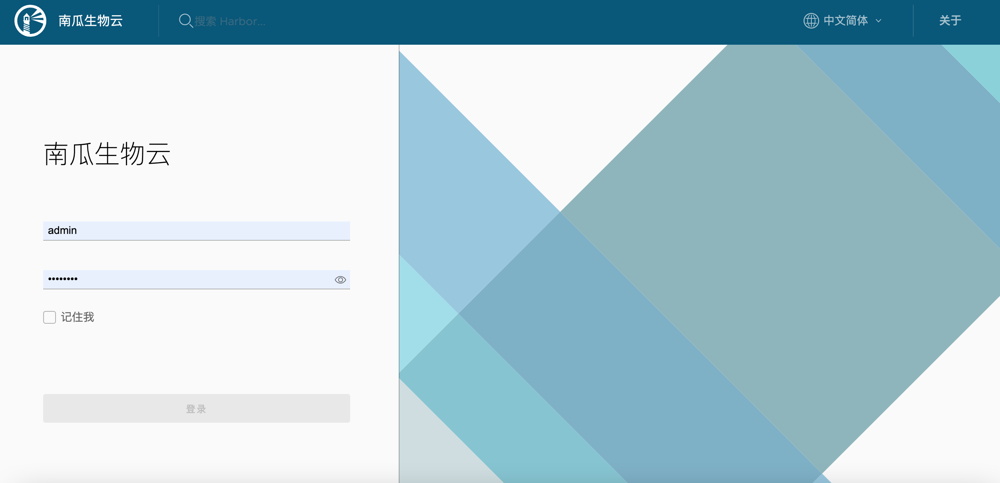
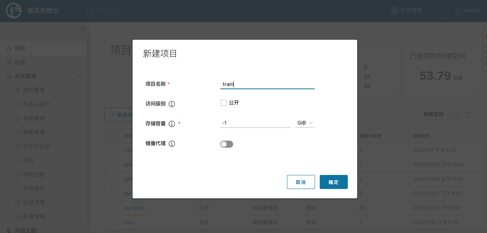
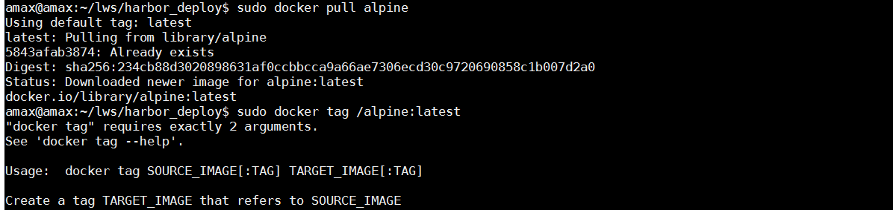
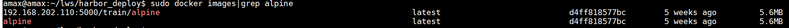
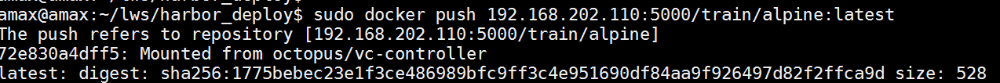
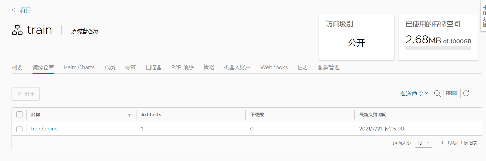

---

sidebar_position: 3
---

# 部署Harbor仓库

本文档为 Harbor 私有云仓库 部署说明，通过 Harbor 服务，实现南瓜生物云平台中各类运行镜像的管理与维护及代码仓 heml 包管理，管理的镜像主要分为如下两类： 

1. 模型管理模块中 notebook 的运行镜像，用于算法的在线编辑与开发功能。
2. 训练管理模块中训练任务的运行镜像，用于模型训练算法的运行载体。

:::note   
南瓜生物云推荐使用 harbor 版本为 2.3.0。同时，考虑到用户在本地可能已经部署有 harbor 仓库的其他版本, 而不同版本存在 api 接口调用的差异，因此南瓜生物云在后端服务配置 base-server/configs/config.yaml 文件中，提供了 harbor 版本的 apiVersion 属性字段，用户可根据实际的 harbor 版本对该字段进行修改，从而实现 harbor 版本控制和兼容（具体详见镜像管理服务代码）。
:::

## 整体部署
### 安装 docker

- 更新 apt 包索引

```console
apt-get update
```

- 安装以下包使 apt 可以通过 HTTPS 使用存储库

```console
apt-get install -y apt-transport-https ca-certificates curl software-properties-common
```

- 添加 docker 官方的 GPG 密钥

```
curl -fsSL https://download.docker.com/linux/ubuntu/gpg | sudo apt-key add -
```

- 设置 stable 存储库

```
add-apt-repository "deb [arch=amd64] https://download.docker.com/linux/ubuntu $(lsb_release -cs) stable"
```

- 更新 apt 包索引

```
apt-get update
```

- 安装最新的 docker 安装包

```
apt-get install -y docker-ce
```

- 启动 docker 并验证

```
systemctl enable docker
systemctl start docker
systemctl status docker
```

### 安装 docker-compose

- 下载 docker-compose

```
curl -L https://get.daocloud.io/docker/compose/releases/download/1.22.0/docker-compose-`uname -s`-`uname -m` >/usr/local/bin/docker-compose
chmod +x /usr/local/bin/docker-compose
```

- 查看 docker-compose 的版本信息

```
docker-compose --version
```

### 安装 python 文件

```
apt-get update
apt-get install python2.7
apt update
apt install python-pip
pip install --upgrade pip
```

### 安装 harbor

- 下载离线安装包（也可以去 github 下载 https://github.com/goharbor/harbor/releases ）

```
wget https://storage.googleapis.com/harbor-releases/harbor-offline-installer-v2.2.3.tgz
```

- 改名、解压文件然后移动到指定文件夹下面

```
mv harbor-offline-installer-v2.2.3.tgz  harbor.tgz
tar -zxvf  harbor-offline-installer-v2.2.3.tgz
mv harbor /usr/local/
```

- 进入 harbor 目录，修改 harbor 配置文件

```
cd harbor
vi harbor.cfg
1) 将 hostname 修改为域名
2) 将 ui_url_protocol 设置为 ui_url_protocol=https
3) 创建文件夹用来存放证书 mkdir -p /data/cert
```

- 进入 cert 目录生成证书

```
openssl genrsa -des3 -out server.key 2048
openssl req -new -key server.key -out server.csr
cp server.key server.key.org
openssl rsa -in server.key.org -out server.key
openssl x509 -req -days 365 -in server.csr -signkey server.key -out server.crt
chmod a+x *
```

- 修改 linux 的 hosts 内容

```
vi /etc/hosts
格式：ip地址 域名(与 harbor.cfg 里面的域名一致)
```

- 修改 docker 的配置文件 daemon.json 文件(执行命令 systemctl daemon-reload 重新加载配置)

```
insecure-registries": ["https://域名"]
```

- 进入 harbor 目录执行命令

```
./install.sh
```

- 登陆到 Harbor 上面

```
docker login https://域名
默认账号：admin
默认密码：Harbor12345
```


## Harbor 使用

要在客户机浏览器上登录 Harbor， 请先配置 Harbor 域名解析，或者修改 hosts 文件进行本地解析:

```
  Windows 系统: C:\Windows\System32\drivers\etc\hosts  
  Linux 系统: /etc/hosts
```

在 hosts 文件中添加 Harbor 服务器 IP 以及配置的 Harbor 域名，如：

```
192.168.202.110  cicd2
```

然后在浏览器输入 Harbor 域名:



默认登录名为 admin，初始密码为 Harbor12345，登录后，新建项目 train (项目中要用到，请务必创建)，并设置存储的容量大小：



新建项目后，即可使用镜像命令上传镜像到 Harbor 仓库 train 项目中了。以 alpine 镜像为例，拉取镜像并 push 到 harbor 私有仓库流程如下：

- 首先拉取 alpine：latest 版本：

```
sudo docker pull alpine
```



- 本地给镜像打 tag：

```
sudo docker tag  alpine:latest  192.168.202.110:5000/train/alpine:latest
```

- 查看当前 alpine 镜像：

```
sudo docker images|grep alpine
```



- 镜像推送到远端私有 harbor 仓库：

```
 sudo docker push 192.168.202.110:5000/train/alpine:latest
```



- 客户机登陆 harbor，可以看到刚才 tag 的镜像就已经推送到 Harbor 仓库的 train 项目中了：




