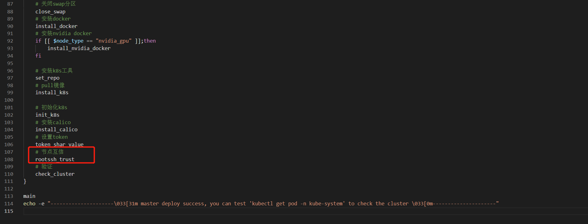
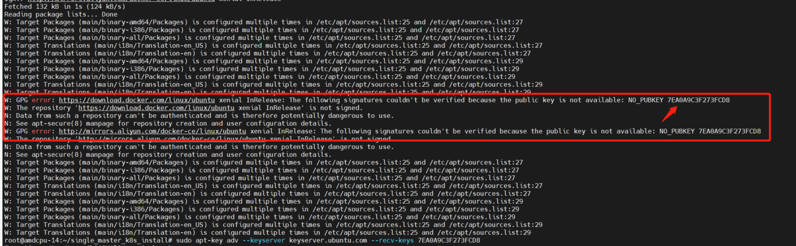
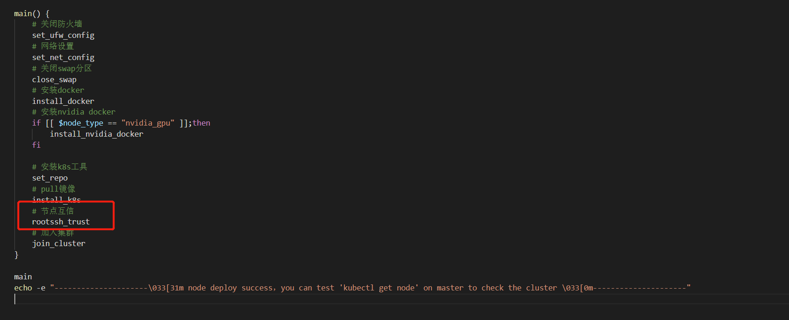

# 部署Kubernetes集群

Pumpkin 使用 Kubernetes 集群来做整个平台的统一管理，是必不可少的一环

:::caution
必须保证【[**环境依赖**](environment.md)】中所有条件已满足才能部署 Kubernetes 集群，否则容易出现各种不可控问题
:::

:::note
平台仅提供 【单 master 节点方案部署】的部署方式，该方式对于集群数较少或者对高可用要求不高的场景适用，通常建议节点数**少于等于 20 个节点**的集群使用
:::

## 版本信息

- **Kubernetes 版本：** `v1.16.3`
- **docker 版本：** `19.03.13`
- **calico 版本：** `v3.10.0`

## 单master节点方案部署

:::note
平台提供了单 master 节点方案的一键部署脚本，**适用于对 Kubernetes 不了解的新手部署，仅需按步骤执行即可**
:::

### 部署脚本说明

下载方式如下：

```shell
wget https://pumpkin.yunqiic.com/install/k8s_install.zip
unzip k8s_install.zip
cd single_master_k8s_install
```

下载下来并解压后的目录结构如下：

| 文件名                                    | 文件功能                            |
| :----:                                    | :----:                             |
| **base.config**                           | 配置文件，需要根据集群情况手动配置   |
| **comm.sh**                               | 公共脚本函数，提供给其他脚本调用     |
| **master_install_k8s.s**                  | master 节点部署脚本                  |
| **node_install_k8s.sh**                   | node 节点部署脚本                    |
| **del_k8s.sh**                            | 卸载 k8s 以及 docker 脚本               |
| **ssh_trust_add.exp、ssh_trust_init.exp** | 服务器互信脚本                      |

### master节点部署

- **root 账户登录 master 节点**

- **部署脚本下载、解压并进入目录**

```shell
cd /root
wget https://pumpkin.yunqiic.com/install/k8s_install.zip
unzip k8s_install.zip
cd single_master_k8s_install
```

- **修改配置**

> ```shell
> vim base.config
> ```
>
> 根据提示修改相关配置项
>
> ```shell
> # master 节点 IP 地址
> masterip="192.168.0.2"
>
> # 过滤 IP 段,用于过滤得到服务器的 IP 地址
> ip_segment="192.168.0"
>
> # k8s 版本，不要更改
> k8s_version="v1.16.3"
>
> # root 用户密码，请设置 k8s 集群所有服务器 root 用户密码为统一密码
> root_passwd="123456"
>
> # 集群所有节点 ip，有几台填几台
> hostip=(
> 192.168.0.1
> 192.168.0.2
> 192.168.0.3
> )
>
> # cidr 网段，默认情况下不用改动
> pod_network_cidr="10.244.0.0/16"
> service_cidr="10.96.0.0/12"
>
> #以下两项会自动生成，不用填写
> tocken=
> sha_value=
> ```
>
> 其中，cidr 网段根据集群大小进行调整，调整方法参考 [**calico网络配置**](#calico网络配置)

- **calico网络配置文件下载**

根据集群的大小情况，下载对应的 calico 配置文件，具体下载方式参考 [**calico网络配置**](#calico网络配置)

:::note
**必须下载 calico 配置文件，否则执行脚本会安装不成功！！！**

下载后的 calico 配置文件需与部署脚本放到同个文件夹中
:::

- **执行脚本**

> - 如果 master 节点是 **NVIDIA GPU** 节点，则执行
>
> ```shell
> ./master_install_k8s.sh nvidia_gpu
> ```
>
> 执行脚本后为了能让 k8s 集群识别到 NVIDIA GPU 资源，还需要安装相对应的设备插件，具体参考 [**nvidia-device-plugin安装**](#nvidia-device-plugin安装)
>
> - 如果 master 节点是 **Huawei A910** 节点，则执行
>
> ```shell
> ./master_install_k8s.sh huawei_a910
> ```
>
> 执行脚本后为了能让 k8s 集群识别到 Huawei A910 资源，还需要安装相对应的设备插件，具体参考 [**huawei-a910-device-plugin安装**](#huawei-a910-device-plugin安装)
>
> :::note
> 出于安全考虑，如果不想让节点之间互信的话，则把 `master_install_k8s.sh` 脚本中的 `rootssh_trust` 注释掉即可
> 
> :::
>
> - 如果 master 节点是普通节点，则执行
> 
> ```shell
> ./master_install_k8s.sh
> ```
> 
> :::note
> 如果执行脚本过程中，出现以下错误:
> 
> 
> 
> 是 ubuntu 源 key 不存在的问题，可以通过手动加入 key 来解决，然后再重新执行脚本即可
> 
> ```shell
> sudo apt-key adv --keyserver keyserver.ubuntu.com --recv-keys <错误提示中箭头所指位置的字符串>
> ```
> :::

- **执行完毕后，执行以下命令看节点是否 ready，k8s 系统组件是否的处于 running 状态**

> ```shell
> kubectl get node
> kubectl get pod -n kube-system
> ```
>
> 如果集群所有组件都是如下状态，那么 master 节点已经部署成功：
>
> ```shell
> NAME          STATUS   ROLES    AGE    VERSION
> master-node   Ready    master   261d   v1.16.3
> ```
>
> ```shell
> NAME                                       READY   STATUS    RESTARTS   AGE
> calico-kube-controllers-689532984b-dd115   1/1     Running   0          73s
> calico-node-5d421                          1/1     Running   0          73s
> coredns-434d7b3231-45216                   1/1     Running   0          73s
> coredns-23445326d2-hjh4v                   1/1     Running   0          73s
> etcd-umaster                               1/1     Running   0          25s
> kube-apiserver-umaster                     1/1     Running   0          22s
> kube-controller-manager-umaster            1/1     Running   0          15s
> kube-proxy-1s34f4                          1/1     Running   0          73s
> kube-scheduler-umaster                     1/1     Running   0          20s
> ```
> 
> 以上步骤执行顺利，子节点 `root` 账户下的 `/root` 目录下会生成 `node_install_k8s.sh`、`base.config` 等文件，方便在 node 节点上安装相关组件并加入 k8s 集群，**如果注释了节点互信代码，则子节点的相应目录下不会产生相应的脚本文件，需要自己手动传输**

### node 节点部署（包括新增 node 节点）

- **root 账户登录 node 节点**

- **执行脚本**

> 如果部署 master 节点时，注释了节点互信代码，或者是**新增的 node 节点**，则需自己传输相应的文件到 node 节点上
>
> 1. 拷贝master节点的 /root/.kube/config 文件夹到node节点的 /root/.kube/config
> 
> 2. 拷贝master节点的 /root/single_master_k8s_install 文件夹到node节点的 /root/single_master_k8s_install
> 
> :::note
> **注意**：如果是**新增 node 节点**，集群创建时自动生成的token和sha_value可能已经失效，需要重新生成一个
> 1. 进入master节点，生成token和sha_value
> ```shell
> kubeadm token create # 生成token
>
> openssl x509 -pubkey -in /etc/kubernetes/pki/ca.crt | openssl rsa -pubin -outform der 2>/dev/null | openssl dgst -sha256 -hex | sed 's/^.* //' # 生成sha_value
> ```
> 2. 拷贝生成的token和sha_value，进到要新增的node节点
> ```shell
> cd  /root/single_master_k8s_install
> vim base.config
> ```
> 将 base.config 中 **tocken** 选项和 **sha_value** 选项的值替换成新生成token的值和sha_value的值
> :::
>
> :::note
> 出于安全考虑，如果不想让节点之间互信的话，则把 `node_install_k8s.sh` 脚本中的 `rootssh_trust` 注释掉即可
> 
> :::

如果 node 节点是 **NVIDIA GPU** 节点，则执行

```shell
cd /root
./node_install_k8s.sh nvidia_gpu
```

执行脚本后为了能让 k8s 集群识别到 NVIDIA GPU 资源，还需要安装相对应的设备插件，具体参考 [**nvidia-device-plugin安装**](#nvidia-device-plugin安装)

如果 node 节点是 **Huawei A910** 节点，则执行

```shell
cd /root
./node_install_k8s.sh huawei_a910
```

执行脚本后为了能让 k8s 集群识别到 Huawei A910 资源，还需要安装相对应的设备插件，具体参考 [**huawei-a910-device-plugin安装**](#huawei-a910-device-plugin安装)

如果 node 节点是普通节点，则执行

```shell
cd /root
./node_install_k8s.sh
```

:::note
如果执行脚本过程中，出现以下错误:


是 ubuntu 源 key 不存在的问题，可以通过手动加入 key 来解决，然后再重新执行脚本即可

```shell
sudo apt-key adv --keyserver keyserver.ubuntu.com --recv-keys <错误提示中箭头所指位置的字符串>
```
:::

- **执行完毕后，在 master 节点执行以下命令看子节点加入集群并处于 ready 状态**

```shell
kubectl get node
```

:::note
如果集群安装过程中出现错误，需要卸载 k8s 以及 docker 并重新安装，可以在各个节点上先执行以下脚本彻底清除相关组件

```shell
./del_kube.sh
```
:::

### 集群虚拟化网络验证

当 k8s 集群的 master 节点和 node 节点均部署成功后，需验证下整个集群的虚拟化网络是否正常

- 按照如下 Pod 的部署文件，使用 kubectl 工具部署 test-calico-pod-1

```shell
vim test-calico-pod-1.yaml
```

复制下文到test-calico-pod-1.yaml中并保存

```shell
apiVersion: v1
kind: Pod
metadata:
  name: test-calico-pod-1
spec:
  containers:
  - name: nginx
    image: nginx
    ports:
    - containerPort: 80
```

在k8s中应用这个yaml

```shell
kubectl apply -f test-calico-pod-1.yaml
```

- 按照如下 Pod 的部署文件，使用 kubectl 工具部署 test-calico-pod-2

```shell
vim test-calico-pod-2.yaml
```

复制下文到test-calico-pod-2.yaml中并保存


```shell
apiVersion: v1
kind: Pod
metadata:
  name: test-calico-pod-2
spec:
  containers:
  - name: nginx
    image: nginx
    ports:
    - containerPort: 80
```

在k8s中应用这个yaml

```shell
kubectl apply -f test-calico-pod-2.yaml
```

- 查询 test-calico-pod-1 与 test-calico-pod-2 的虚拟 IP

```shell
kubectl get pod -o wide | grep test-calico-pod
```

- 登入 test-calico-pod-1 的容器内，ping 通 test-calico-pod-2 的 IP 即验证成功

```shell
kubectl exec -it test-calico-pod-1 bash

ping ${test-calico-pod-2的IP}
```

## 设备插件安装 

:::note
如果节点拥有其他资源，如 GPU、FPGA 等，为了在 k8s 集群中能够发现并利用这些资源，需要安装相应的设备插件
:::

### nvidia-device-plugin安装 

:::note
为了在k8s集群中能够发现 NVIDIA GPU 资源，需要安装 NVIDIA 的设备插件，如果 k8s 集群中不存在 NVIDIA GPU 节点，则跳过这一步
:::

- **前提条件**

1. NVIDIA GPU 节点必须预先安装了 **NVIDIA 驱动**（具体操作见【[**环境依赖**](environment.md)】）
2. NVIDIA GPU 节点必须预先安装 **nvidia-docker2.0**（已包含在快速部署脚本中，通过"nvidia_gpu"参数确定）

- **在 master 节点执行命令，安装 nvidia 的设备插件**

1. 下载yaml文件
```shell
wget https://raw.githubusercontent.com/NVIDIA/k8s-device-plugin/v0.9.0/nvidia-device-plugin.yml
vim nvidia-device-plugin.yml
```

2. 添加 nodeSelector 选项，只部署在有nvidia gpu的节点上

```shell
apiVersion: apps/v1
kind: DaemonSet
metadata:
  ...
spec:
  ...
  template:
    metadata:
      ...
    spec:
      nodeSelector:                 # 新增
        hardware-type: NVIDIAGPU    # 新增
      ...
```

3. 安装插件

```shell

kubectl create -f nvidia-device-plugin.yml
```

- **在 master 节点执行命令，查看是否安装成功**

```shell
kubectl describe node |grep gpu
```

如果有看到 **nvidia.com/gpu** 有值则说明安装成功。

### huawei-a910-device-plugin 安装 

:::note
为了在 k8s 集群中能够发现 Huawei A910 资源，需要安装 Huawei 的设备插件，如果 k8s 集群中不存在 Huawei A910 节点，则跳过这一步
:::

- **前提条件**

Huawei A910 节点必须预先安装了 **Huawei A910 驱动**（具体操作见【[**环境依赖**](environment.md)】）

- **在 master 节点执行命令，安装 huawei 的设备插件**

```shell
kubectl create -f https://gitee.com/apulisplatform/k8s-device-plugin/raw/master/deployment/a910-device-plugin.yaml
```

- **在 master 节点执行命令，查看是否安装成功**

```shell
kubectl describe node |grep npu
```

如果有看到 **npu.huawei.com/NPU** 有值则说明安装成功。

## calico网络配置

:::note
针对不同的用户场景，需根据集群大小做相应网络配置调整，以求达到最佳的性能表现
:::

### 集群节点少于50个

- 下载配置文件

```shell
curl https://docs.projectcalico.org/v3.10/manifests/calico.yaml -O
```

- 修改配置文件 `calico.yaml` 的 `CALICO_IPV4POOL_CIDR`、`IP_AUTODETECTION_METHOD` 配置项

```shell
kind: DaemonSet
apiVersion: apps/v1
metadata:
  name: calico-node
  namespace: kube-system
  labels:
    k8s-app: calico-node
spec:
  ...
  containers:
    ...
    env:
      ...
      # - name: CALICO_IPV4POOL_CIDR
      #   value: "192.168.0.0/16"
      ...
      - name: IP_AUTODETECTION_METHOD
        value: "can-reach=${DNS 服务器 IP 地址}"
```

去掉 `CALICO_IPV4POOL_CIDR` 注释（注意-要与其他项的-对齐，否则会报错），并配置 value 值，使其与 `base.conf` 中的 `pod_network_cidr` 配置项保持一致

增加 `IP_AUTODETECTION_METHOD` 配置项，value 值后面的网段配置为DNS 服务器 IP 地址，或者参考 [**calico几个重要的部署环境变量的作用解释**](#calico几个重要的部署环境变量的作用解释)，根据自身集群情况配置

### 集群节点大于 50 个

- 下载配置文件

```shell
curl https://docs.projectcalico.org/v3.10/manifests/calico-typha.yaml -o calico.yaml
```

- 修改【[**单master节点方案部署**](#单master节点方案部署)】中提供的配置文件 `base.conf` 的 `cidr网段` 配置项

```shell
# cidr 网段
pod_network_cidr="10.244.0.0/16"
service_cidr="10.96.0.0/12"
```

`pod_network_cidr`、`service_cidr` 根据集群大小，预估可能存在 pod 的数量，重新划分 pod 和 service 的虚拟网段，保证能满足集群使用，不会出现 ip 地址用尽问题

:::note
`service-cidr` 网段不能和 `pod_network_cidr` 重叠
:::

- 修改配置文件 `calico.yaml` 的 `CALICO_IPV4POOL_CIDR`、`IP_AUTODETECTION_METHOD` 配置项

```shell
kind: DaemonSet
apiVersion: apps/v1
metadata:
  name: calico-node
  namespace: kube-system
  labels:
    k8s-app: calico-node
spec:
  ...
  containers:
    ...
    env:
      ...
      # - name: CALICO_IPV4POOL_CIDR
      #   value: "192.168.0.0/16"
      ...
      - name: IP_AUTODETECTION_METHOD
        value: "can-reach=${DNS 服务器 IP 地址}"
```

去掉 `CALICO_IPV4POOL_CIDR` 注释，并配置 value 值，使其与 `base.conf` 中的 `pod_network_cidr` 配置项保持一致

增加 `IP_AUTODETECTION_METHOD` 配置项，value 值后面的网段配置为DNS 服务器 IP 地址，或者参考 [**calico几个重要的部署环境变量的作用解释**](#calico几个重要的部署环境变量的作用解释)，根据自身集群情况配置

- 修改配置文件 `calico.yaml` 的 `calico-typha` 组件具有负载均衡功能的副本数

```shell
apiVersion: apps/v1beta1
kind: Deployment
metadata:
  name: calico-typha
  ...
spec:
  ...
  replicas: <副本数>
```

建议每 200 个节点至少创建一个副本，不超过 20 个副本,在生产环境中，我们建议至少使用 3 个副本，具体可以参见【[**Calico 官方文档**](https://docs.projectcalico.org/getting-started/kubernetes/self-managed-onprem/onpremises)】

配置完毕之后，可以使用【[**单master节点方案部署**](#单master节点方案部署)】提供的快速部署脚本，一键部署 master 节点

### calico几个重要的部署环境变量的作用解释
- **CALICO_IPV4POOL_CIDR:** 集群 Pod 的 IP 的 cidr 网段

- **CALICO_IPV4POOL_IPIP:** 集群 Pod 之间的数据包路由模式
    1. IPIP 模式填写: "Always"
    2. Bgp 模式填写: "Off"
    3. 跨网段模式填写: "CrossSubnet" (跨网段模式即 IPIP-Bgp 混合模式: 同子网内路由采用 Bgp 模式，跨子网路由采用 IPIP 模式)

- **IP_AUTODETECTION_METHOD:** calico 实例发现节点目标物理网卡的方法
    1. 不配置 IP_AUTODETECTION_METHOD：默认使用"first-found"寻找节点物理网卡方法，即寻找到第一个网卡设定为节点的目标物理网卡
    2. "interface=${正则表达式}": 使用正则表达式寻找节点的目标物理网卡
    3. "can-reach=${DNS 服务器 IP 地址}": 使用 ping 通 DNS 服务器 IP 的方法寻找节点的目标物理网卡
    4. "cidr=${物理网卡 IP 所在的 CIDR 网段}": 使用  CIDR 的网段匹配方法寻找节点的目标物理网卡(v3.10版本不支持)

- **KUBERNETES_SERVICE_HOST:** 在多 master 高可用集群模式下，可配置 Kubernetes API Server 的 HTTP 代理的 IP 地址

- **KUBERNETES_SERVICE_PORT:** 在多 master 高可用集群模式下，可配置 Kubernetes API Server 的 HTTP 代理的 Port 端口

- **KUBERNETES_SERVICE_PORT_HTTPS:** 在多 master 高可用集群模式下，可配置 Kubernetes API Server 的 HTTPS 代理的 Port 端口

## 存储驱动安装（v4.0.5+）

:::note
针对第三方平台接口支持的存储类型，需要安装对应的存储驱动才能正常使用
:::

### juicefs

1. 下载yaml文件

```shell
wget https://git.yunqiic.com/Yunqiic/pumpkin/src/tag/v4.0.5/deploy/single_master_k8s_install/juicefs_csi_driver.yaml	
#k8s v1.18及以上
```

或者

```shell
wget https://git.yunqiic.com/Yunqiic/pumpkin/src/tag/v4.0.5/deploy/single_master_k8s_install/juicefs_csi_driver_before_v1_18.yaml #k8s v1.18以下
```

2. 安装驱动

```shell
kubectl apply -f juicefs_csi_driver.yaml
```

3. 查看是否安装成功

```shell
kubectl -n kube-system get pods -l app.kubernetes.io/name=juicefs-csi-driver
```

