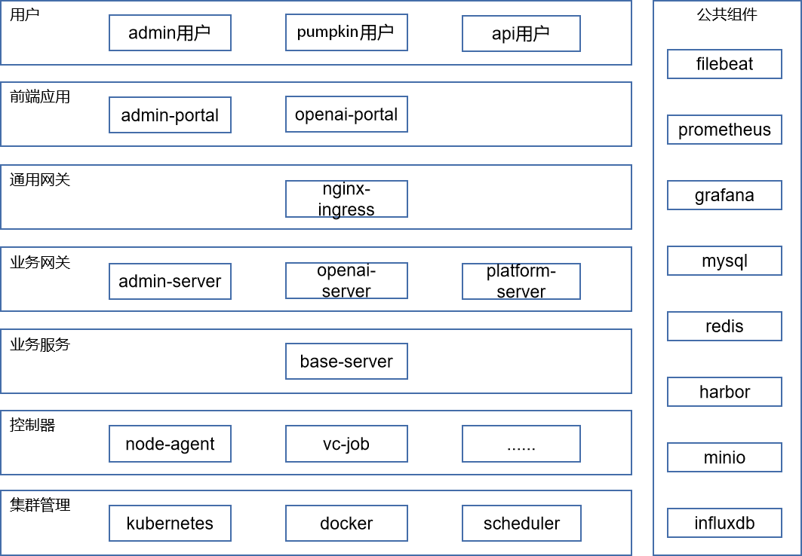
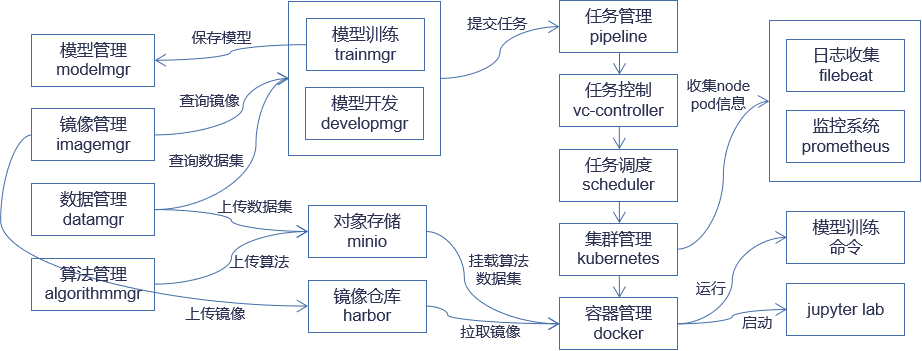

# 架构设计

## 架构分层

如图所示，平台技术架构由七大部分组成：

### 用户

用户分为三类用户，第一类是操作管理后台的admin用户，第二类是使用南瓜计算平台来运行训练任务的pumpkin用户，第三类则是通过api调用来使用南瓜能力的api用户。

### 前端应用

前端应用包括计算平台openai-portal和管理后台admin-portal，计算平台主要针对AI、HPC等场景的计算与资源管理的需求来设计，向用户提供了对数据、算法、镜像、模型与算力等资源的管理与使用功能，方便用户一站式构建计算环境和实现计算。管理后台向集群管理人员提供了集群资源管理与监控，计算任务管理与监控等功能，方便集群管理人员对整体系统进行操作与分析。

### 通用网关

通用网关采用的是 Nginx 官方社区开发的产品 NGINX Ingress controller。NGINX Ingress controller 可与 NGINX 和 NGINX Plus 一起使用，并支持标准的 Ingress 功能——基于内容的路由和 TLS/SSL 终止。此外，一些 NGINX 和 NGINX Plus 功能可通过注释和 ConfigMap 资源作为 Ingress 资源的扩展。除了 HTTP，NGINX Ingress controller 还支持负载均衡 Websocket、gRPC、TCP 和 UDP 应用程序。

### 业务网关

业务网关包括计算平台后端 openai-server 和管理后台后端 admin-server，是服务于前端的后端（Back-end For Front-end），与前端一一对应，负责组装和裁剪底层业务服务提供的接口，面向前端提供更友好的粗粒度接口，前端和业务网关直接通过 http 协议通信。

### 业务服务

业务服务base-server实现了计算平台的核心业务功能供业务网关调用，包括数据管理、算法管理、镜像管理、模型开发、模型训练、模型管理和资源管理，还有用户相关的用户管理、群组管理、计费管理和鉴权管理，业务网关和业务服务通过 rpc 协议通信。为方便开源用户，各个功能模块实现在一个服务里，但内部实现里各个功能模块是独立的，不允许跨模块访问数据表等，因此也能够比较容易地改造成多个微服务。

### 控制器

控制器实现了任务等各种CRD 自定义资源，CRD 是对 K8S API 的扩展，代表了一个特定的 kubetnetes 的定制化安装。在一个运行中的集群中，自定义资源可以动态注册到集群中。注册完毕以后，用户可以通过 kubelet 创建和访问这个自定义的对象，类似于操作 pod 一样。

### 集群管理

集群管理包括以下几部分：

- kubernetes

  Kubernetes 是 Google 开源的一个容器编排引擎，它支持自动化部署、大规模可伸缩、应用容器化管理。在 Kubernetes 中，我们可以创建多个容器，每个容器里面运行一个应用实例，然后通过内置的负载均衡策略，实现对这一组应用实例的管理、发现、访问，而这些细节都不需要运维人员去进行复杂的手工配置和处理。

- docker

  Docker 是一个开源的应用容器引擎，让开发者可以打包他们的应用以及依赖包到一个可移植的容器中,然后发布到任何流行的 Linux 机器或 Windows 机器上,也可以实现虚拟化,容器是完全使用沙箱机制,相互之间不会有任何接口。

- scheduler

  Scheduler 发现集群中新创建且尚未被调度到 Node 上的 Pod。 调度器会将发现的每一个未调度的 Pod 调度到一个合适的 Node 上来运行。 调度器会依据下文的调度原则来做出调度选择。

### 公共组件

公共组件包括以下几部分：

- filebeat

  Filebeat 是使用 Golang 实现的轻量型日志采集器，也是 Elasticsearch stack 里面的一员。本质上是一个 agent ，可以安装在各个节点上，根据配置读取对应位置的日志，并上报到相应的地方去。Filebeat 的可靠性很强，可以保证日志 At least once 的上报，同时也考虑了日志搜集中的各类问题，例如日志断点续读、文件名更改、日志 Truncated 等。

- prometheus

  prometheus是由谷歌研发的一款开源的监控软件，目前已经被云计算本地基金会托管，是继 k8s 托管的第二个项目。prometheus 有以下优势：（1）易于管理（2）轻易获取服务内部状态（3）高效灵活的查询语句（4）支持本地和远程存储（5）采用 http 协议（6）默认 pull 模式拉取数据，也可以通过中间网关 push 数据。

- grafana

  Grafana 是一款用 Go 语言开发的开源数据可视化工具，可以做数据监控和数据统计，带有告警功能。Grafana 有以下特点：（1）可视化（2）报警（3）通知（4）动态仪表盘（5）混合数据源（6）注释（7）过滤器。

- mysql

  1. MySQL 是一种关系型数据库管理系统，MySQL 所使用的 SQL 语言是用于访问数据库的最常用标准化语言。MySQL 由于其体积小、速度快、总体拥有成本低，尤其是开放源码这一特点，一般中小型网站的开发都选择 MySQL 作为网站数据库。

- redis

  Redis 是 NoSql 四大分类中的键值型存储数据库。它是一个开源的，先进的 key-value，通常被称为数据结构服务器。因为它支持存储的 value 类型可以包含（string）字符串、（list）链表、（hash）哈希、（set）集合、（zset）有序集合等多种数据结构。

- harbor

  Harbor 是为企业用户设计的容器镜像仓库开源项目，包括了权限管理(RBAC)、LDAP、审计、安全漏洞扫描、镜像验真、管理界面、自我注册、HA 等企业必需的功能，同时针对中国用户的特点，设计镜像复制和中文支持等功能。

- minio

  MinIO 是一款高性能、分布式的对象存储系统。MinIO 与传统的存储和其他的对象存储不同的是：它一开始就针对性能要求更高的私有云标准进行软件架构设计。因为 MinIO 一开始就只为对象存储而设计。所以他采用了更易用的方式进行设计，它能实现对象存储所需要的全部功能，在性能上也更加强劲，它不会为了更多的业务功能而妥协，失去 MinIO 的易用性、高效性。

- influxdb

  InfluxDB是一个由InfluxData开发的开源时序型数据。它由Go写成，着力于高性能地查询与存储时序型数据。InfluxDB被广泛应用于存储系统的监控数据，IoT行业的实时数据等场景。

## 数据流向

平台的数据流向如图所示：

1. 镜像、数据集、算法经由镜像管理、数据管理、算法管理上传到镜像仓库和对象存储后；
2. 模型训练或模型开发提交任务到任务管理；
3. 任务经由任务控制、任务调度、集群管理、容器管理，最后运行模型训练命令或者启动 jupyter lab。

## 服务组件

| 服务          | 说明           |
| ------------- | -------------- |
| openai-portal | 计算平台前端 |
| admin-portal  | 管理后台前端 |
| openai-server | 计算平台后端 |
| admin-server  | 管理后台后端 |
| base-server   | 业务后端     |
| pipeline      | 任务调度服务   |
| scheduler     | 任务调度引擎   |
| vc-controller | job 控制器      |
| grafana       | 数据可视化     |
| prometheus    | 服务监控系统   |
| minio         | 对象存储       |
| redis         | 缓存数据库     |
| mysql         | 关系型数据库   |
| harbor        | 镜像仓库       |

## 技术栈

### 后端技术

| 技术       | 名称                | 官网                                |
| ---------- | ------------------- | ----------------------------------- |
| Kubernetes | 容器编排引擎        | https://www.kubeflow.org/           |
| Docker     | 应用容器引擎        | https://www.docker.com/             |
| Harbor     | 镜像仓库            | https://goharbor.io/                |
| Grafana    | 数据可视化工具      | https://grafana.com/                |
| Prometheus | 服务监控系统        | https://prometheus.io/              |
| Minio      | 对象存储服务        | http://www.minio.org.cn/            |
| Redis      | 缓存数据库          | https://redis.io/                   |
| Mysql      | 关系型数据库        | https://www.mysql.com/              |
| JupterLab  | Web 集成开发环境     | https://jupyter.org/                |
| Helm       | Kubernetes 包管理器 | https://helm.sh/                    |
| Volcano    | 容器批量计算引擎    | https://volcano.sh/                 |
| GoLang     | 编程语言            | https://golang.google.cn/           |
| Kratos     | Go 微服务框架       | https://github.com/go-kratos/kratos |
| GORM       | ORM 框架             | https://gorm.io/                    |
| Grpc       | 远程过程调用框架    | https://www.grpc.io/                |
| Protobuf   | 数据序列化          | https://github.com/google/protobuf  |

### 前端技术

| 技术       | 名称                  | 官网                                       |
| ---------- | --------------------- | ------------------------------------------ |
| Html       | 超文本标示语言        | https://www.w3school.com.cn/html/index.asp |
| Css        | 层叠样式表            | https://www.w3school.com.cn/css/index.asp  |
| JavaScript | web 脚本语言           | https://www.javascript.com                 |
| Vue        | 渐进式 JavaScript 框架 | https://cn.vuejs.org                       |
| Sass       | 预编译样式语言        | https://www.sass.hk                        |
| Node.js    | JavaScript 运行引擎    | https://nodejs.org/zh-cn                   |
| Element-ui | 可视化组件库          | https://element.eleme.cn/#/zh-CN           |
| Webpack    | 模块打包器            | https://webpack.docschina.org              |
| Swipper    | 轮播图插件            | https://www.swiper.com.cn                  |