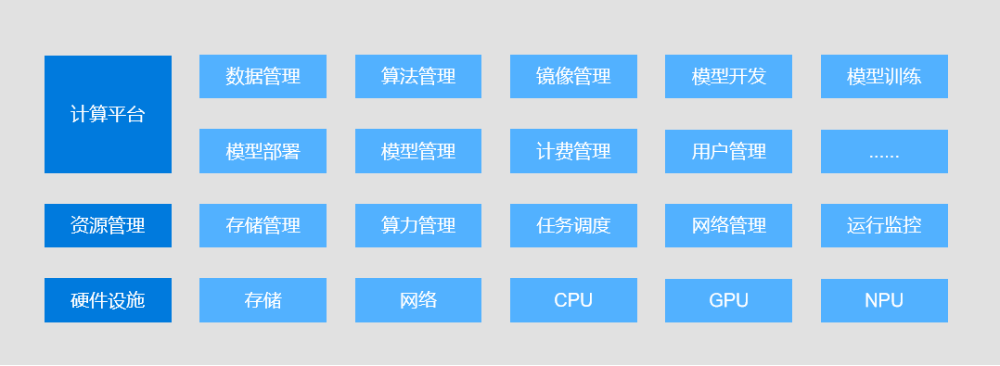

# 平台架构

平台架构如图所示：

### 计算平台

计算平台实现了计算平台的核心业务功能，包括数据管理、算法管理、镜像管理、模型开发、模型训练、模型部署、模型管理、计费管理和用户管理等。

### 资源管理

资源管理主要是对集群的资源进行管理和调度，包括存储管理、算力管理、任务调度、网络管理等。

### 硬件设施

硬件设施为计算平台所管理和调度的设备，包括存储、网络、CPU、GPU 等各类设备。
