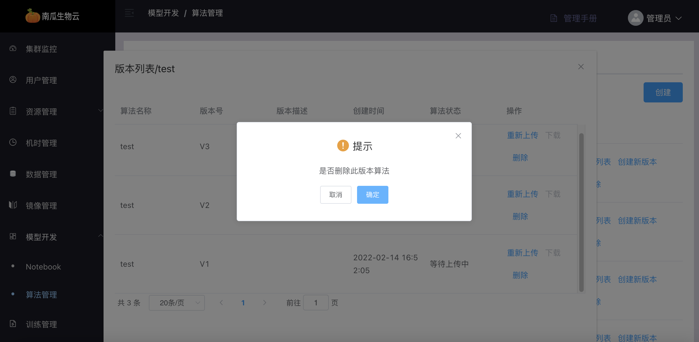

# 算法管理

:::note
算法分为用户算法、预置算法
:::

算法是用户上传的代码文件，利用算法创建训练任务可以生成模型或调试代码。

## 预置算法

预置算法是指管理员创建的算法，用户可以查询到预置算法并使用、复制、下载预置算法。

管理员在预置算法界面可以使用的功能包括：预置算法列表查询、预置算法版本列表查询、创建预置算法、创建预置算法版本、删除预置算法版本、删除预置算法、下载预置算法版本。

### 预置算法列表查询

预置算法列表中可管理员创建的预置算法信息。

### 预置算法版本列表查询

预置算法版本列表中可看到管理员创建的某个算法的所有版本信息，通过点击要查看的算法的“版本列表”按钮进入。

### 创建预置算法

点击算法管理界面的“创建”按钮进入。通过填写算法基本信息创建算法，包括以下参数。需要创建预置算法的同时上传算法代码，注意上传代码只能选择 zip 格式的压缩包。

| 参数           | 描述                                                          |
|---------------------|----------------------------------------------------------------------|
| `算法名称`      | 不可与其他预置算法名称重复                   |
| `模型名称`  | 用于以后使用该算法创建训练任务，生成的模型名称                       |
| `算法描述`      | 用于描述该算法功能、用途等                                |
| `模型类别`      | 描述算法用途                                |
| `框架类型`      | 描述算法框架                              |

### 创建预置算法版本

当管理员创建预置算法时，上传的算法代码被系统识别为版本 1，此后管理员可以创建新版本，创建完后的新版本号为当前最新的版本号加 1。创建新版本需要重新上传代码，作为新版本预置算法的代码使用。通过点击需要创建新版本的算法栏的“创建新版本”按钮进入。

### 删除预置算法版本

删除管理员创建的预置算法的某一版本，删除后将不能够继续查询到该算法版本，用户也不能再继续使用该算法版本。通过点击版本列表中的“删除”进入。

### 删除预置算法

删除管理员创建的某一预置算法，删除后该预置算法的所有版本也将被删除。将不能够继续查询到该预置算法，用户也不能再继续使用该预置算法的任一版本。通过点击算法管理界面中该算法栏的“删除”进入。

### 下载预置算法版本

将预置算法的某一版本的代码包以 zip 压缩包的格式下载到管理员的浏览器。通过点击版本列表中的“下载”进入。

## 用户算法

用户算法是指普通用户的算法，管理员可以查询所有用户的算法列表、查询用户算法版本列表、下载用户算法版本。

### 查询用户算法列表

用户算法版本列表中可看到用户的某个算法的所有版本信息，通过点击要查看的算法的“版本列表”按钮进入。

### 下载用户算法列版本

将用户算法的某一版本的代码包以 zip 压缩包的格式下载到管理员的浏览器。通过点击版本列表中的“下载”进入。

### 算法配置

算法配置包括模型类别和框架类型，管理员新增和删除自定义的模型类别和框架类型

