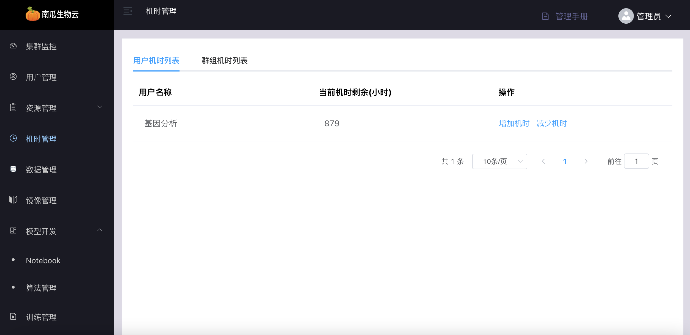
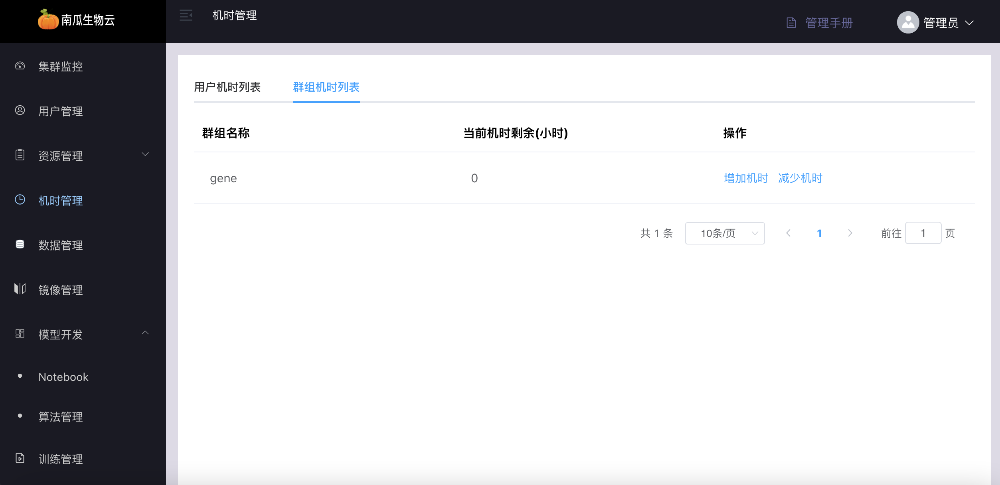
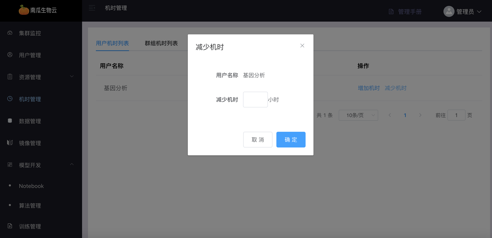
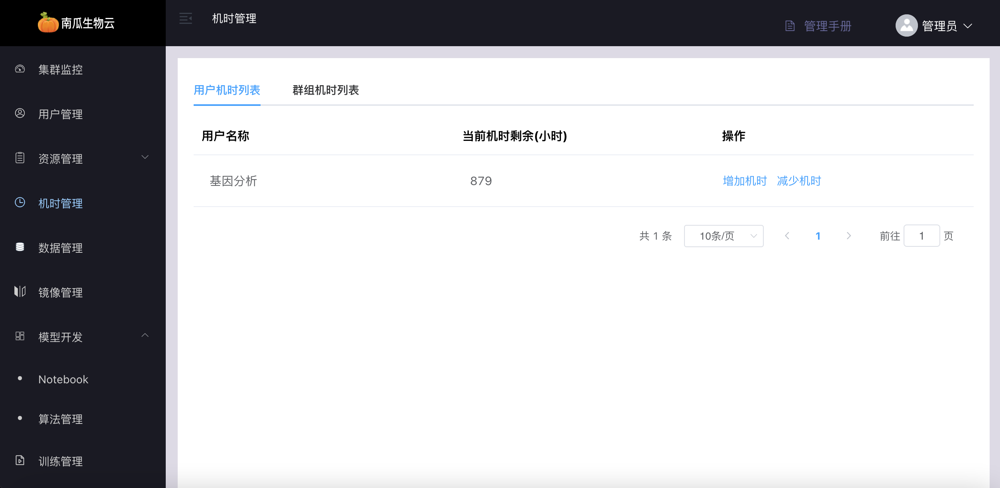

# 机时管理

南瓜平台使用机时为单位进行计费，当用户进行模块开发或者模型训练时，需要扣取相应的机时。平台按照资源规格设置单价 n 机时/小时，计费规则如下：

```
任务机时 = 子任务 1 机时 + 子任务 2 机时 + ... + 子任务 n 机时
子任务机时 = 副本 1 机时 + 副本 2 机时+ ... + 副本 n 机时
副本机时 = 资源规格 * (副本运行终止时间 - 副本运行起始时间)
```

机时管理包括机时列表，充值记录和消费记录
机时列表包括用户机时和群组机时，当用户处于默认群组时，消费的是用户机时；当用户处于非默认群组时，消费的是群组机时

## 用户机时列表

用户机时列表可查看所有用户机时信息




## 群组机时列表

群组机时列表可查看所有群组机时信息




## 增加机时

增加机时可以给用户或者群组增加机时


## 减少机时

减少机时可以给用户或者群组减少机时




## 充值记录

包括用户充值记录和群组充值记录



## 消费记录

包括用户消费记录和群组消费记录

