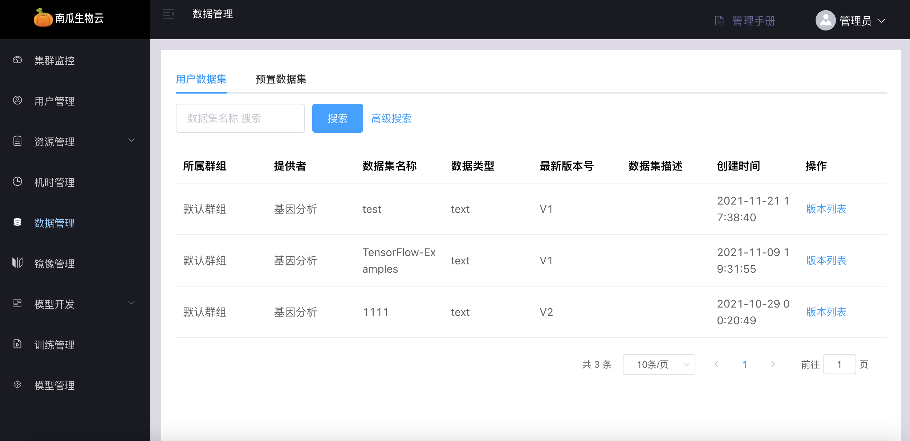
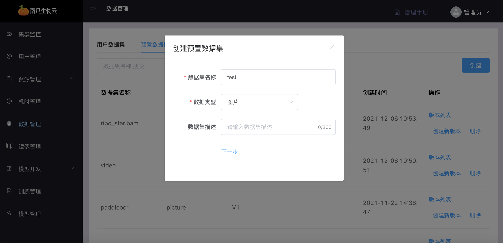
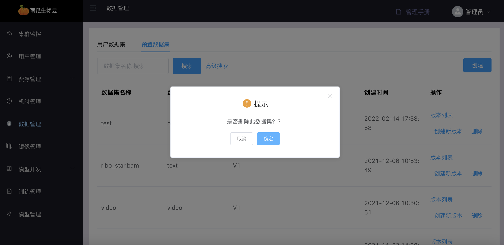
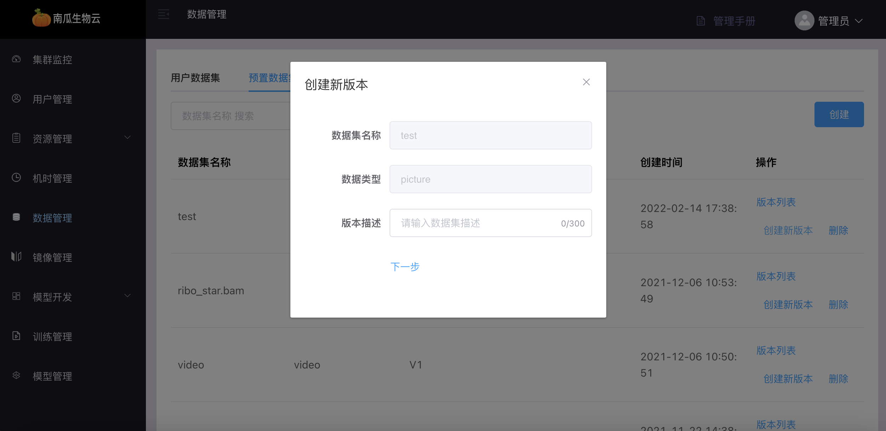
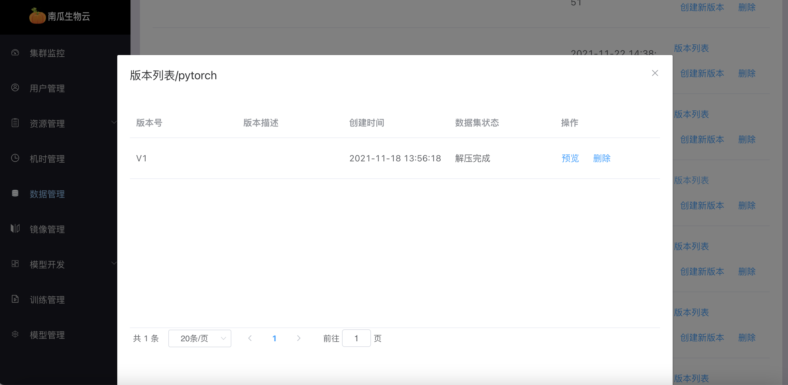
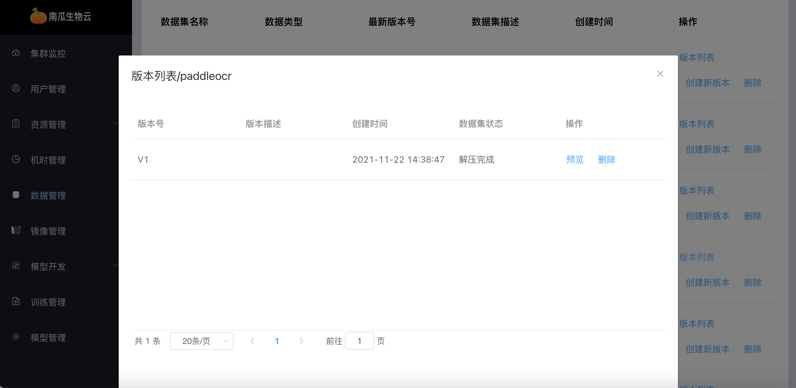
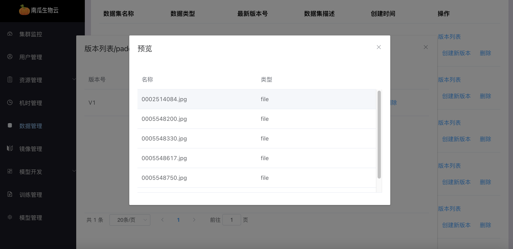
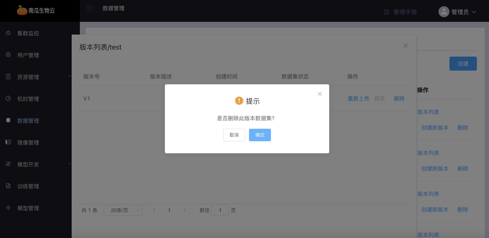
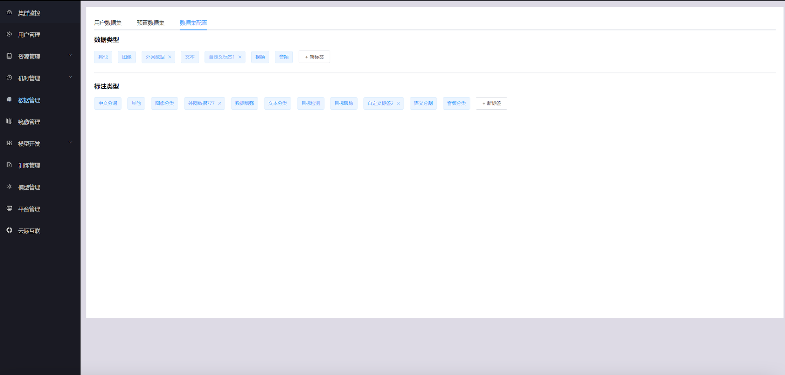
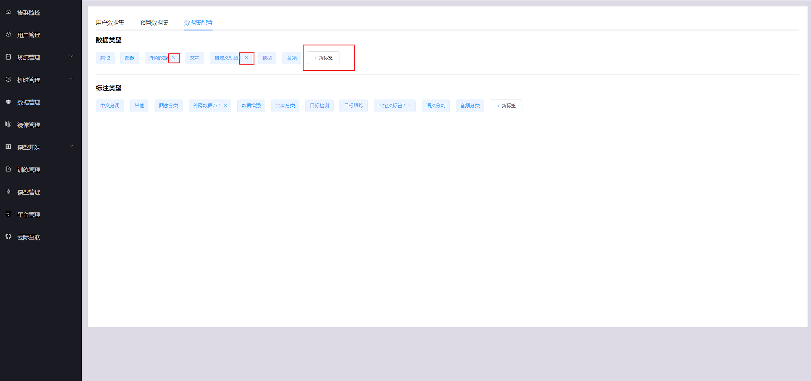

# 数据管理

数据管理分为用户数据集和预置数据集。用户数据集是用户上传的数据集，预置数据集是管理员上传的数据集

## 数据集列表

点击用户数据集或预置数据集按钮，可查看对应数据集列表

## 创建数据集

进入预置数据集列表，点击创建按钮，填入相关信息并上传数据集压缩包，点击确定创建数据集

## 删除数据集

点击删除按钮，删除数据集

## 创建新版本

点击创建新版本按钮，填入相关信息并上传数据集压缩包

## 版本列表

点击版本列表按钮，查看数据集版本列表

## 预览版本

点击预览按钮，查看版本的文件目录

## 删除版本

版本列表里点击删除按钮，删除版本

## 数据集配置

数据集配置包括数据类型和标注类型，管理员新增和删除自定义的数据类型和标注类型

