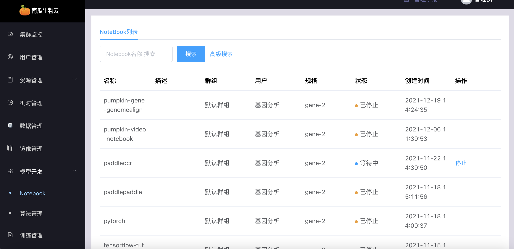

# 开发管理

## notebook管理

notebook 管理提供在线编程环境，用来调试、运行和保存算法以支撑后续的模型训练。该模块支持开源的 JupterLab，用户制作 notebook 类型的镜像时需要参考[这里](../develop/notebook_image.md)。用户可以创建、打开、启动、停止、删除 notebook，用户在 JupterLab 里编辑算法将会自动保存

:::note

- notebook会将算法、数据集分别挂载到/code、/dataset 目录，因此 notebook 镜像需要不占用/code、/dataset 目录
- 用户如果没有进行停止操作，notebook 默认 2 个小时会自动停止以释放资源给更多的人使用

:::

### notebook列表

notebook 列表可分页查看 notebook 信息

### notebook详情

点击详情按钮，可分别查看「任务简况」、「运行信息」、「事件记录」

点击下拉框，选择子任务查看对应运行信息

查看notebook任务启停事件记录

### 停止notebook

点击停止按钮，停止 notebook

