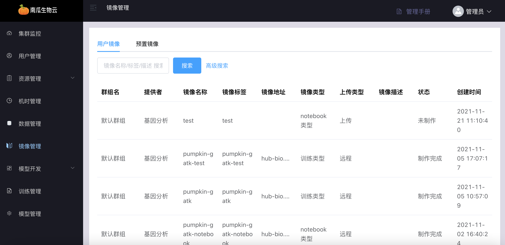
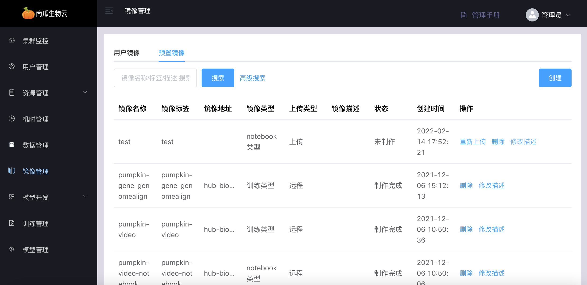
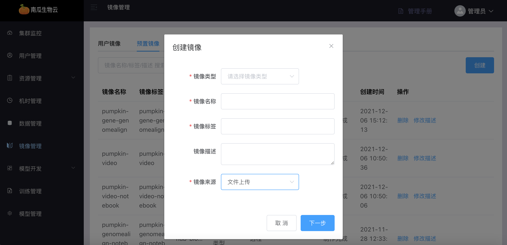
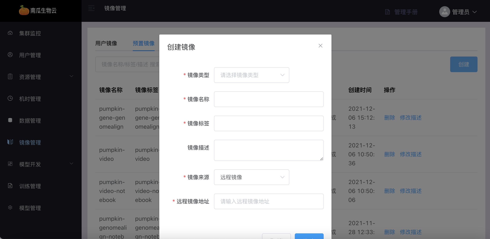
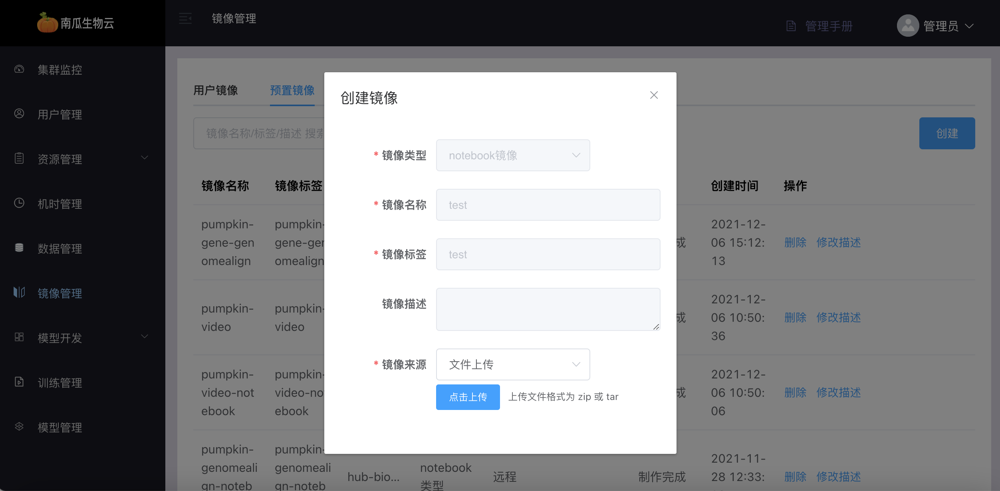
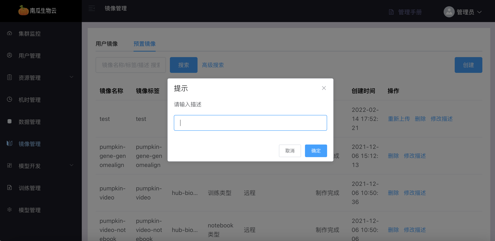
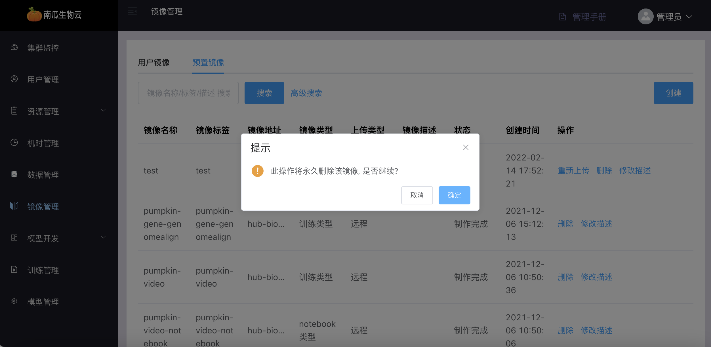

# 镜像管理

:::note
此处镜像是指 Docker 格式的容器镜像。
:::

镜像是算法运行的载体，镜像以容器的方式启动，提供运行程序的环境。

镜像管理模块包括用户镜像管理与预置镜像管理。

镜像来源分为两类：远程镜像地址与上传镜像包，其中：

- 远程镜像地址为 Dockerhub 或者其他镜像仓库中的镜像地址；
- 上传镜像包是指通过`docker save`命令将镜像保存成`tar`格式压缩包，再上传；

## 用户镜像

用户镜像是指用户自己创建的镜像。

用户镜像管理主要功能包括：用户镜像列表与查询。

### 用户镜像列表

用户镜像列表中可看到所有用户创建的镜像信息。



## 预置镜像

预置镜像是指向用户提供的镜像，预置镜像由管理员创建，用户只有使用权限。

预置镜像管理主要功能包括：预置镜像列表与查询，创建预置镜像，修改镜像描述，删除预置镜像。

### 预置镜像列表

预置镜像列表中可看到所有预置镜像基本信息。



### 创建预置镜像

通过填写预置镜像基本信息创建预置镜像，其中：

镜像来源分为通过远程镜像地址与上传镜像包。



其中创建远程镜像需要填写远程镜像地址，如下：



通过上传镜像包方式创建镜像需要先将镜像导出成镜像压缩包，例如：

```shell
docker save nvcr.io/nvidia/tensorflow:21.07-tf2-py3　-o nvidia-tensorflow21.07-tf2-py3.tar
```

而后通过填写上传镜像信息，在`下一步`后选择镜像压缩文件上传，如下：




### 修改镜像描述

修改预置镜像描述信息，可方便用户了解镜像用途。



### 删除预置镜像

预置镜像一旦删除将无法恢复。


