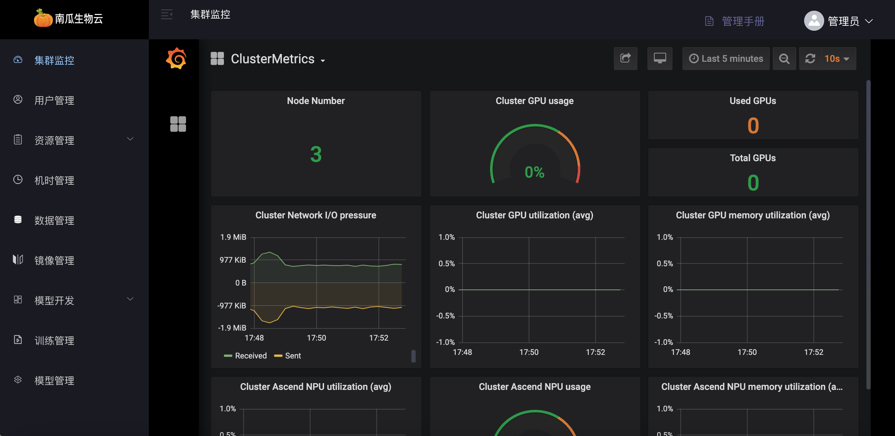
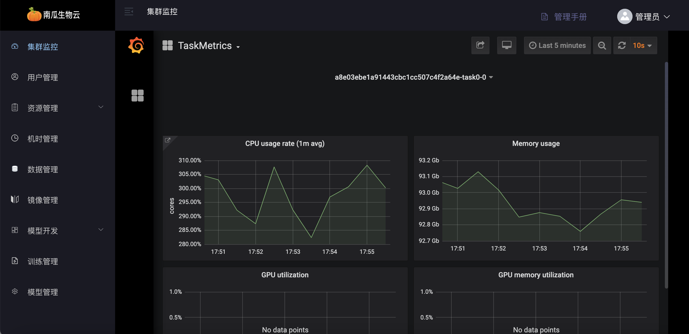
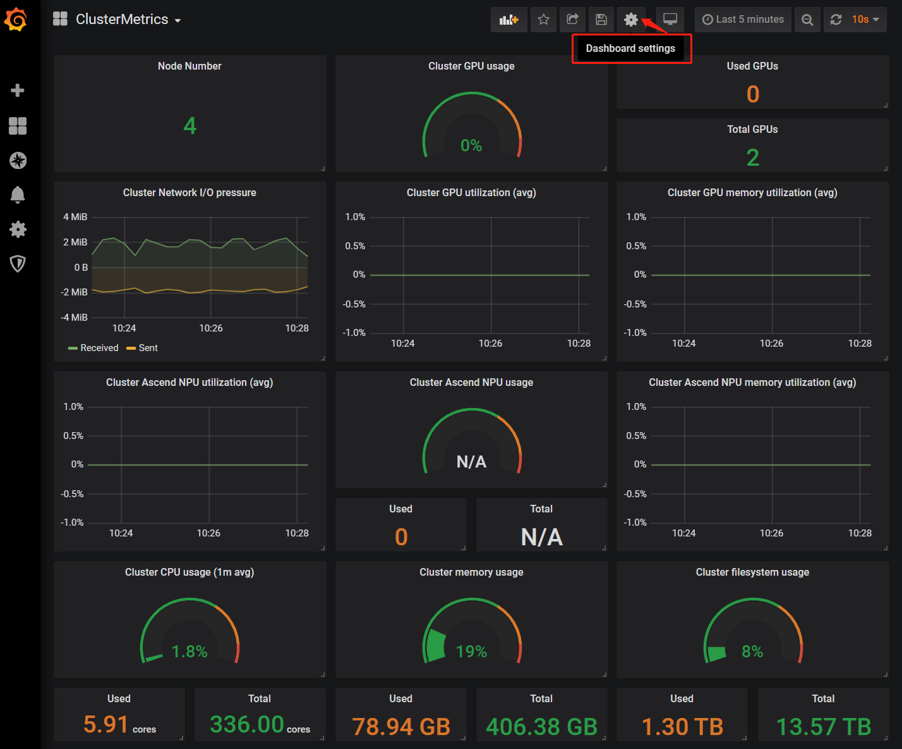
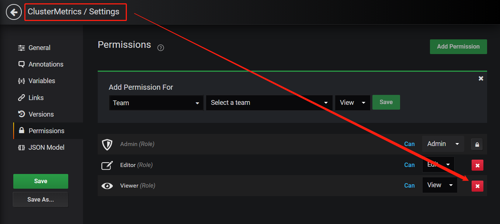

# 平台监控

「南瓜生物云一站式开发」的监控架构为 NodeExporter+Prometheus+Grafana，面向对象为集群监控和训练任务监控，以 Grafana 网页的形式展示。NodeExporter 可以收集到节点的各种资源信息，使用情况，并且以 prometheus 支持的数据格式存储与本地文件。Prometheus 以 Pull 的形式，将每个节点的 NodeExporter 服务的本地数据收集汇聚到其中心数据库。Grafana 网页前端服务启动前配置好 Prometheus 的数据库 API 调用路径，定时请求 Prometheus 的数据指标，就可向用户动态地展示集群和用户正在运行的任务的指标数据的图表。

### 集群监控

集群监控集成于平台的管理端，以 Grafana 网页的形式内嵌于管理端网页内。

如下图，【登录管理网络端/集群监控】展示了集群信息：

### 训练任务监控

训练任务监控集成于平台的的用户端，以 Grafana 网页的形式内嵌于用户端任务详情中。

如下图，【登录用户网页端/训练管理/任务详情/任务负载】选择子任务后可展示训练任务的监控信息，包括 CPU、内存、GPU 使用率、GPU 显存使用率、网络 I/O 等指标：

### 监控权限管理

平台对监控数据指标的权限控制可分为管理员与用户，管理员可看到的监控指标更多，普通用户只能看到局部的监控指标。Grafana 支持对监控指标进行角色管理，角色可分为 admin 与 viewer。管理员可使用 Grafana 管理端配置每个监控网页的角色。

如下图：第一步管理员登录 grafana 指标服务（$cluster-ingress-ip/grafana/login），选择一个监控网页，点击 Setting 按钮：

如下图：第二步选择【Permissions 配置项】，一个监控网页默认有 3 种角色与权限。Viewer 代表任何人包括游客可见，Editor 代表网页默认可编辑，Admin 代表管理员可删除/编辑/可见。如果要设置该网页不可让游客可见，可删除 Viewer 角色与权限，然后点击 Save 按钮生效

