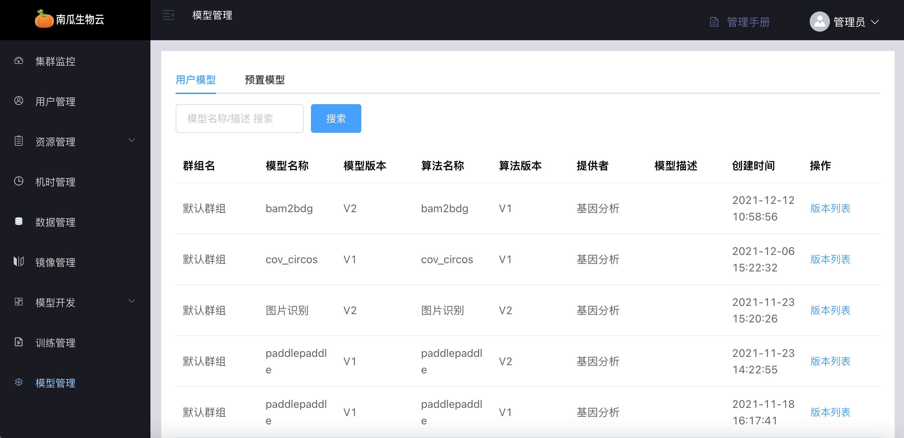
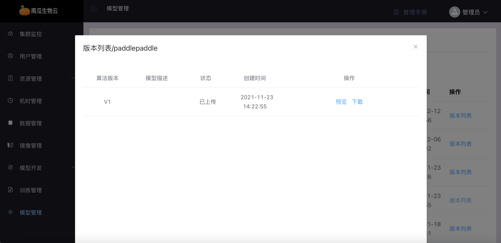
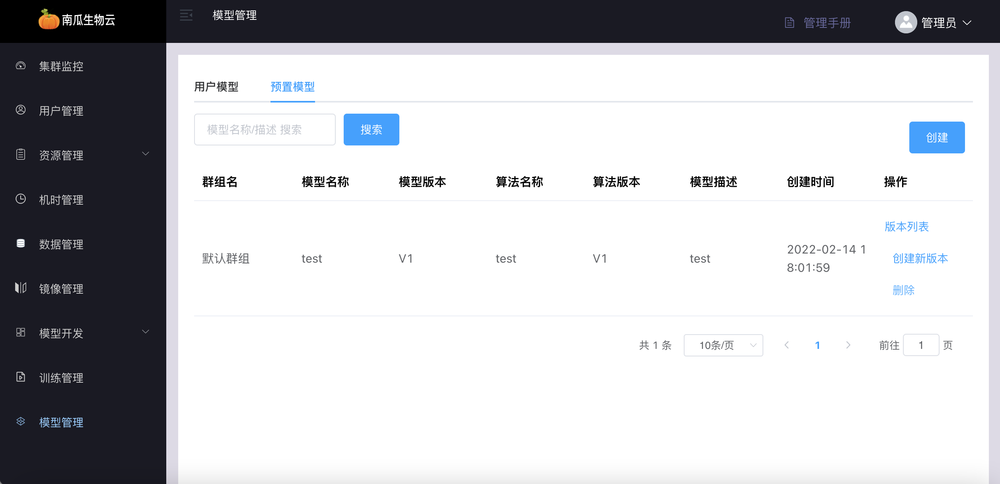
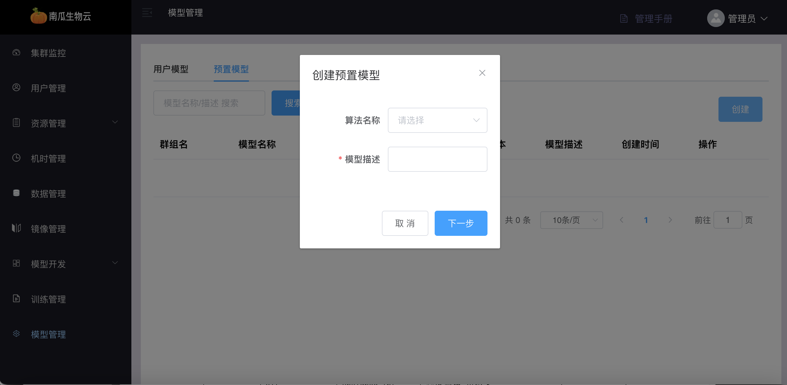
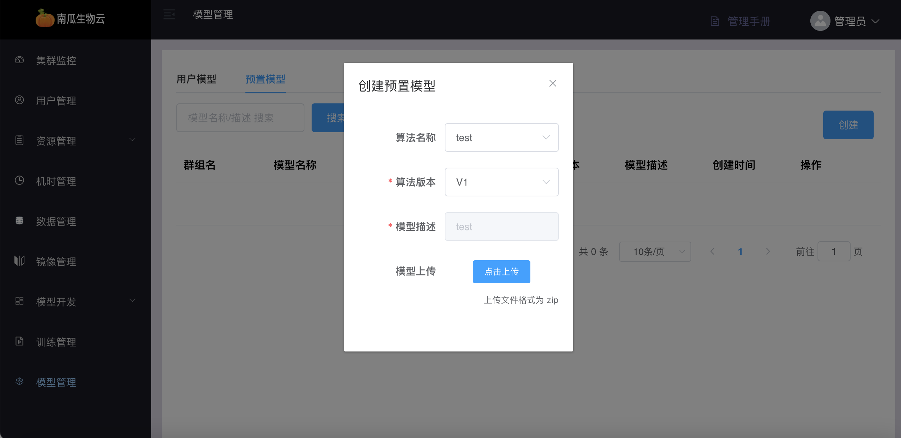
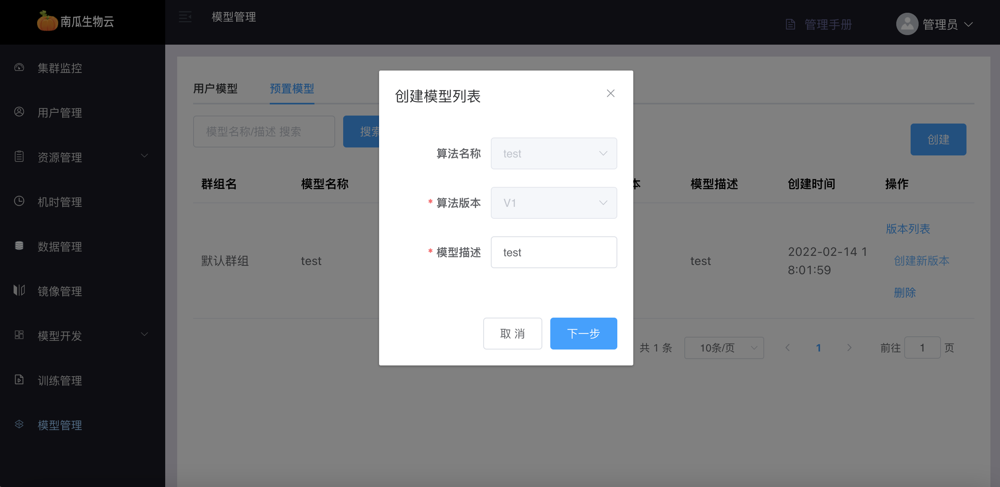
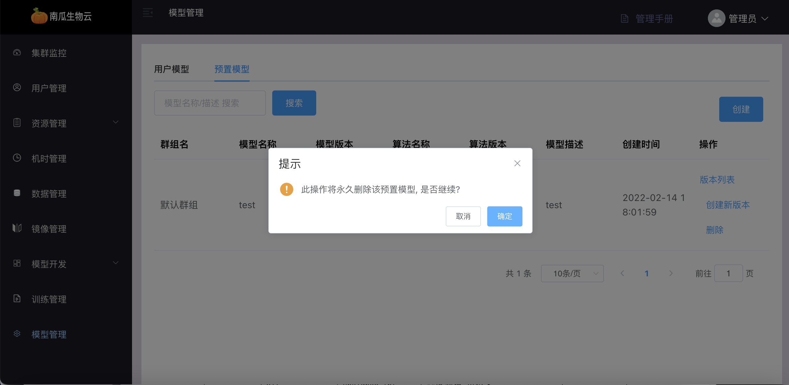

# 模型管理

模型是算法训练产生的结果，通过管理可以帮助用户归档，并为后续的模型验证和部署提供基础条件。

模型管理模块包括`用户模型管理`与`预置模型管理`。

## 用户模型

用户模型是指用户自己在某个群组中通过算法训练得到的模型。

### 用户模型列表

用户模型列表中可看到所有用户创建的模型信息。

### 用户模型版本列表

用户模型版本列表中可看到单个用户模型的版本信息，包括模型的`预览`和`下载`

- 预览：可以查看模型的文件夹结构及内容

- 下载：可以把算法训练后的模型文件压缩包下载下来，方便在其他地方使用

## 预置模型

预置模型是指向用户提供的模型，预置模型由管理员创建，用户只有使用权限。

### 预置模型列表

预置镜像列表中可看到所有预置模型基本信息。

### 创建预置模型

模型创建需与对应的算法绑定，并通过填写预置模型基本信息创建预置模型，如下：

点击下一步后选择模型压缩文件上传，如下：

### 创建预置模型新版本

与创建预置模型类似，只不过所绑定算法无法变更，版本号会自动递增，如下：

### 删除预置模型

预置模型一旦删除将无法恢复。

