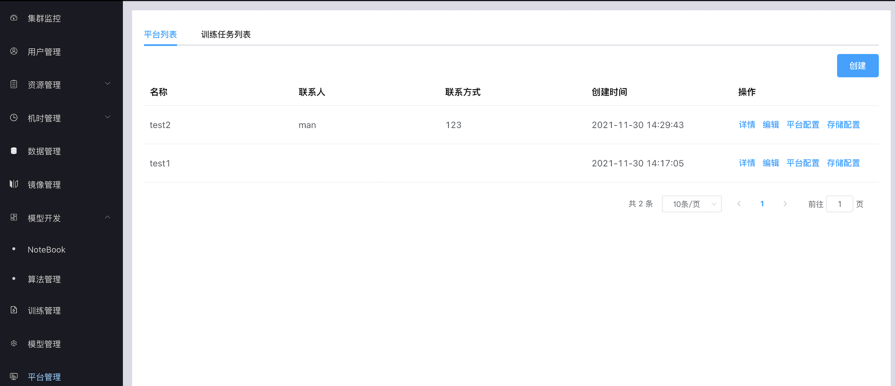
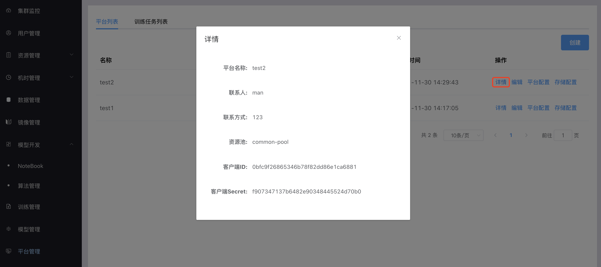
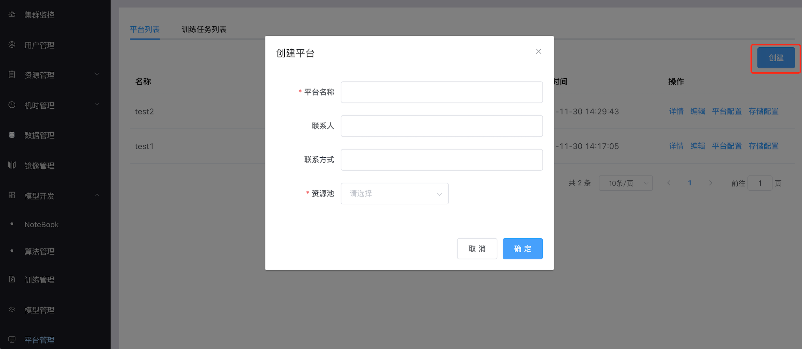
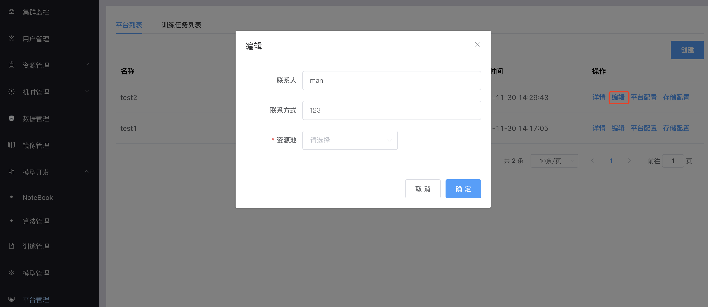
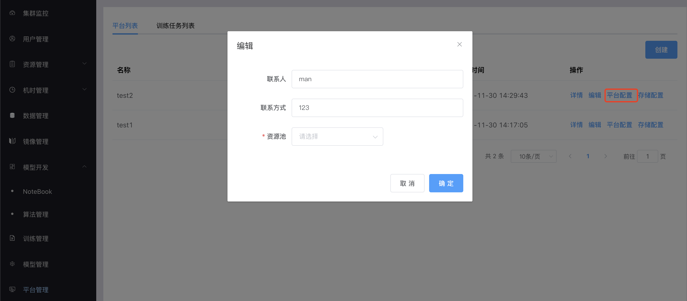
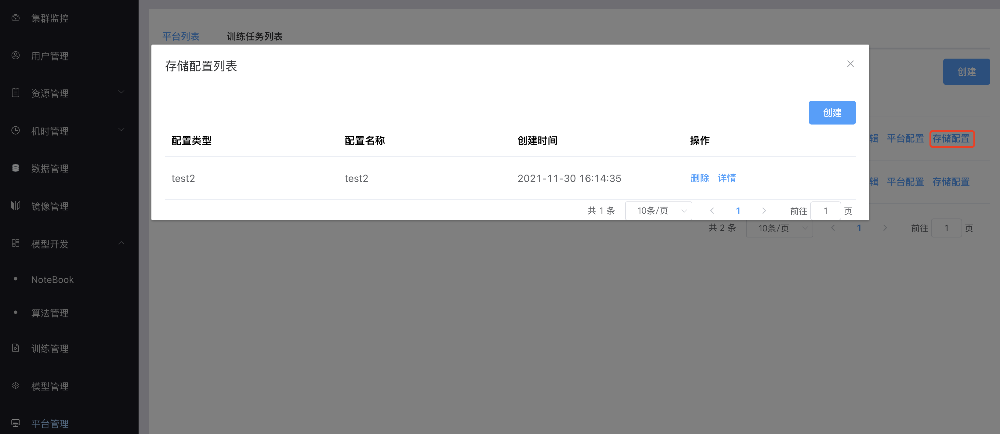
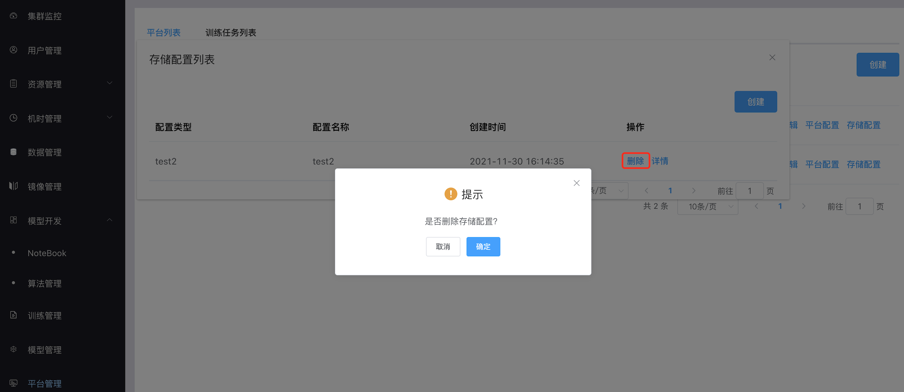
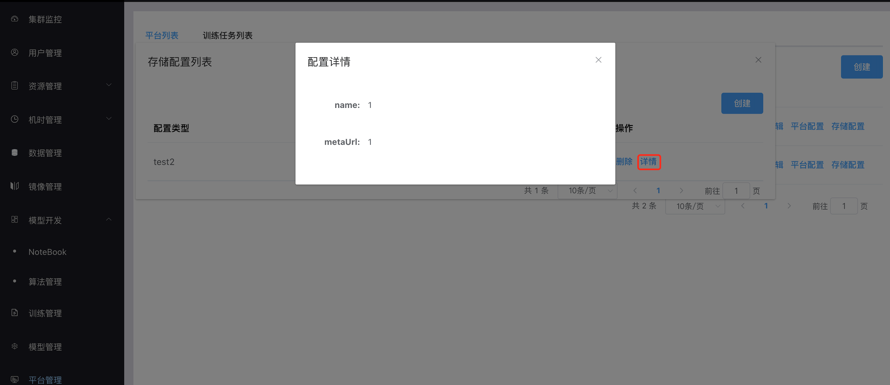
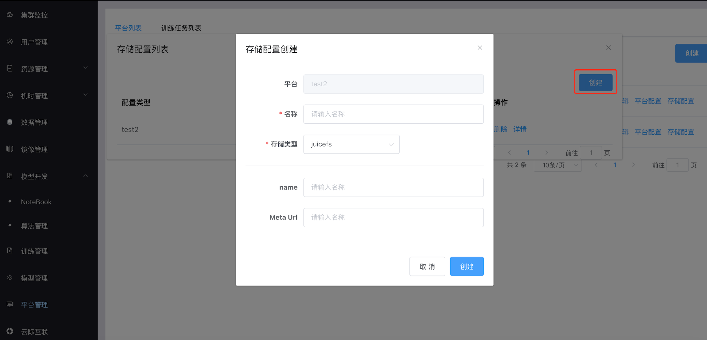
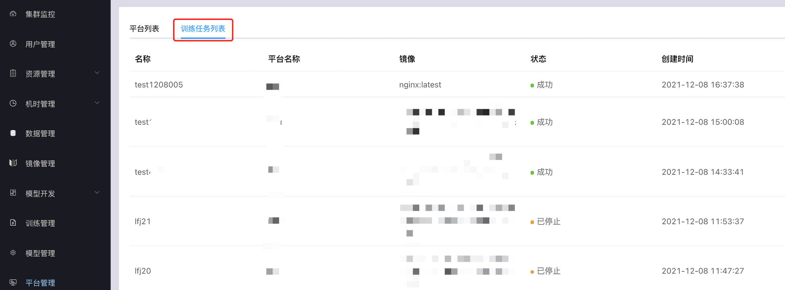

# 平台管理

平台管理对第三方平台进行管理，第三方平台是指通过API而不是通过页面的方式与南瓜交互的平台级别用户，平台管理包括平台列表与训练任务列表。

## 平台列表

管理员在平台列表界面可以使用的功能包括：平台列表查询、平台创建、平台详情查看、平台编辑、平台配置、存储配置。

### 平台列表查询

### 平台详情查看

点击详情按钮，查看平台详情，其中客户端ID和客户端Secret需要提供给第三方平台发送API请求时鉴权使用。

### 平台创建

点击创建按钮，填写相关信息，点击确定创建平台。

### 平台编辑

点击编辑按钮，对平台进行编辑，点击确定完成编辑。

### 平台配置

点击平台配置按钮，对平台进行配置，点击确定完成配置。

### 存储配置

存储配置是第三方平台存储的配置信息，根据存储系统类型的不同所需的配置信息也不同，目前只支持juicefs，juicefs所需的信息为文件系统名称和元数据地址。 管理员在存储配置界面可以使用的功能包括：存储配置列表查询、存储配置删除、存储配置详情查看、存储配置创建。

#### 存储配置列表

点击存储配置按钮，查看存储配置列表。

#### 存储配置删除

点击删除按钮，点击确定删除相关配置。

#### 存储配置详情查看

点击详情按钮，查看相关配置详情信息。

#### 存储配置创建

点击创建按钮，填写相关信息，点击确定按钮创建存储配置。

## 训练任务列表

管理员在训练任务列表界面可以使用的功能包括：训练任务列表查询。

### 训练任务列表查询

点击训练任务列表按钮，查看列表。

