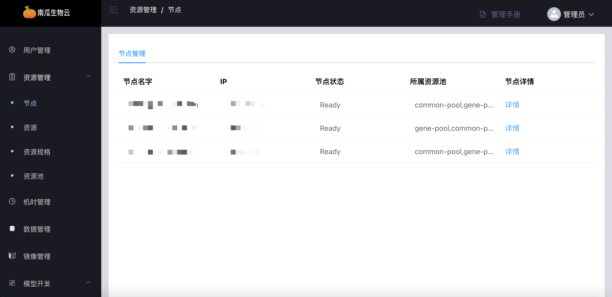
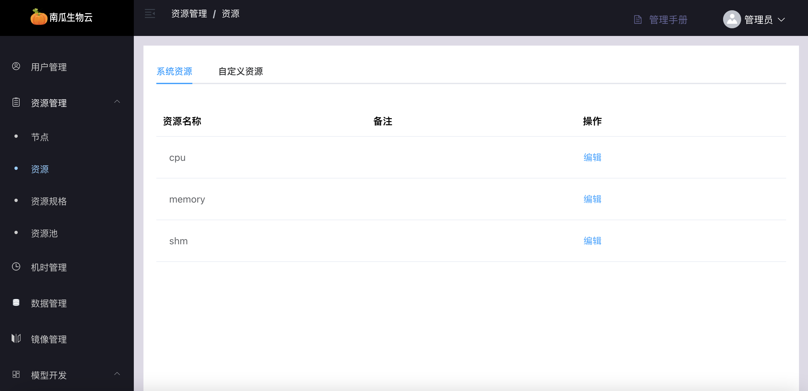
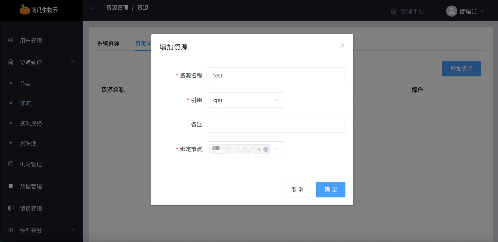
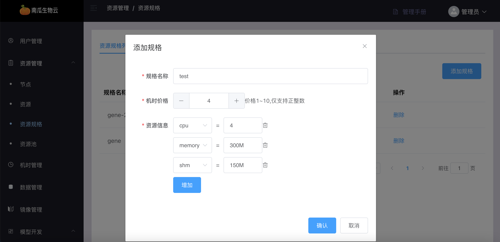
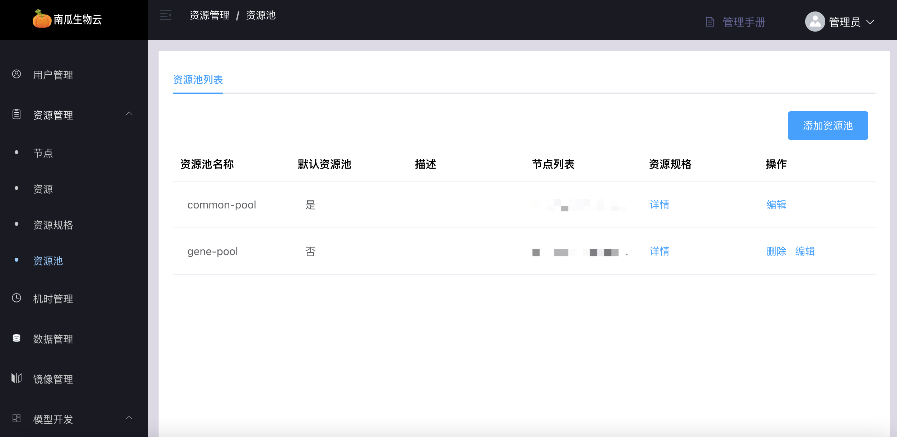

# 资源管理

「南瓜生物云一站式开发平台」管理端支持对平台硬件资源进行便捷管理。平台资源管理模块可以分为服务器节点、系统资源、自定义资源、资源规格、资源池。

### 节点

节点即服务器，平台底层集群系统在启动的时候会**自动发现**已经组成集群的服务器，发现其各种属性。如 IP、Hostname、所赋予的标签、是否 Ready 的状态、拥有何种资源等详情信息。

如下图，【登录管理网页端/资源管理/节点】展示了系统自动发现的**节点列表**：

### 资源

从物理上看，所有资源都组装于服务器节点，并由平台**系统自动发现**，即是系统资源。系统资源有各种名字，各种区分形式，它可以根据各种逻辑划分。

如下图，【登录管理网页端/资源管理/资源】展示了自动发现的**系统资源列表**：

为了方便管理、友好展示、感性利用，平台设计了自定义资源功能，管理员可根据不同的逻辑将已有的系统资源重新定义为一种新的自定义资源。

如下图，【登录管理网页端/资源管理/资源/自定义资源】可根据系统资源**增加自定义资源**（P100GPU）：

### 资源规格

为了更好地向用户展示平台所拥有的资源还有更好地统计用户使用资源的情况。平台将服务器上组装的不同种类的资源归为一个组，这种将资源归为组的功能即是资源规格。管理员定义好资源规格的名字，用户就可感性地从资源规格名字中获取资源的信息，选择自己想要的资源组用于运行自己的任务。

如下图，【登录管理网页端/资源管理/资源规格】可根据所有资源**创建资源规格**（4CPU-2P100GPU-300M 内存-150M 共享内存）：

### 资源池

资源池用于隔离集群的服务器资源。纵向看，资源以服务器节点为粒度。横向看，资源又以资源规格为粒度。服务器节点面向管理员，资源规格面向用户。自然地，如果要更好地将资源与用户解耦与隔离，需要一个资源池的概念。资源池将资源逻辑地重新分割，南瓜生物云平台以服务器节点为粒度，将资源以服务器节点的形式整体划分到不同的资源池，不同的资源池可以绑定到用户群组。以这样的形式，可以很好地将集群的资源隔离，不同的资源可分配给不同的用户群。

如下图，【登录管理网页端/资源管理/资源池】系统自带的**默认资源池**初始化包含所有资源节点，也可根据不同业务逻辑点击按钮**创建新的资源池**（team1-pool）：

### 

