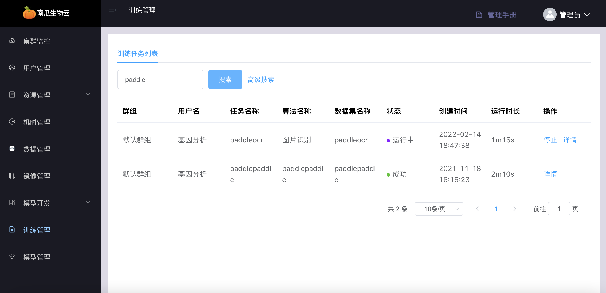
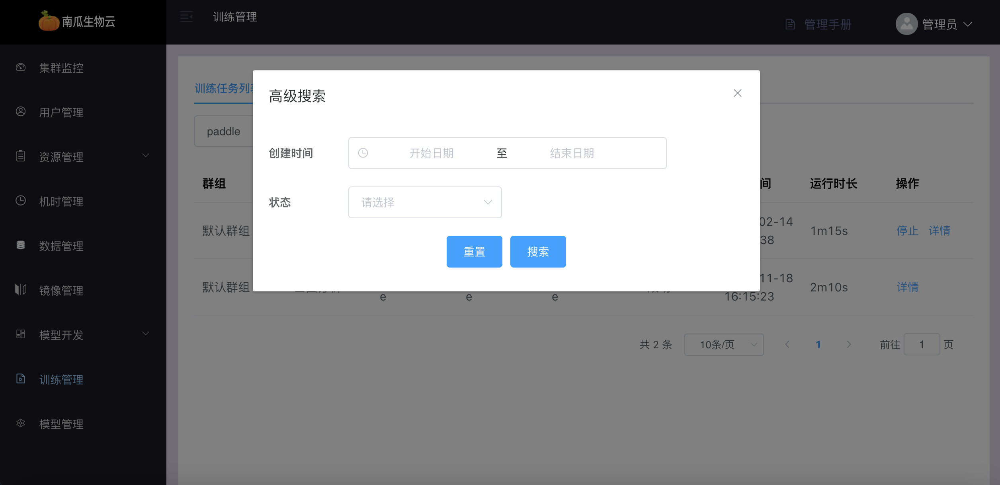
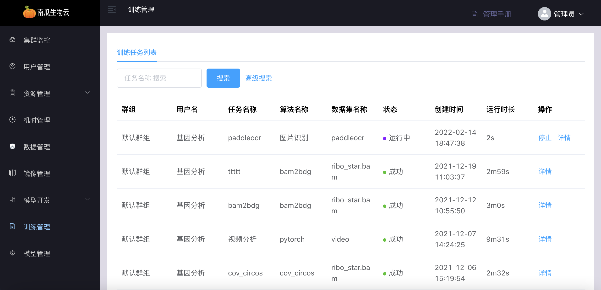

---

sidebar_position: 10
---

# 训练管理

管理端的训练管理模块可以查看所有用户提交的任务信息、可以强制停止某个任务、查询单个任务详情信息。

## 任务列表查询

查询如下：

## 任务名称模糊搜索

可根据任务名称模糊搜索：

## 高级搜索

可以根据任务的时间，任务的状态，搜索任务。

## 停止任务

管理员可以停止所有用户所提交的运行任务。

