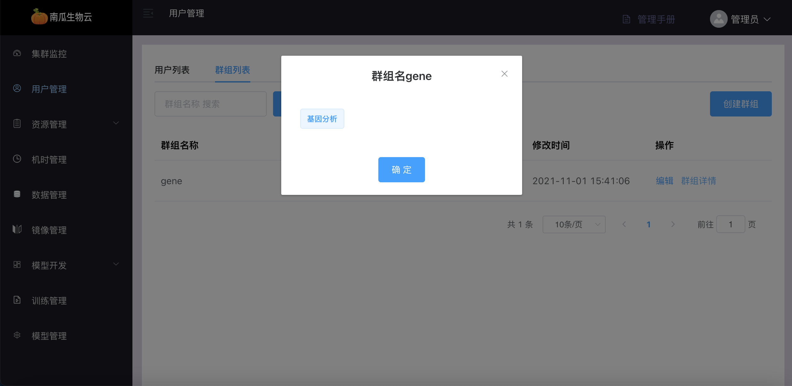

# 用户管理

用户管理模块包括账号管理与群组管理．

## 账号管理

账号管理主要功能包括：账号列表，账号详细，新增账号，重置密码，账号冻结/解冻，用户配置．

### 账号列表

账号列表中可看到所有用户账号和账号基本信息．

### 账号详情

账号详细可查看用户账号归属的群组．

### 新增账号

通过填写账号基本信息，创建新的用户账号．

### 重置密码

通过填写新的用户密码修改账号密码．

### 账号冻结/解冻

用户账号被冻结后，将无法登录系统，已登录状态的账号将被强制下线．

### 用户配置

用户配置中，可选择该用户是否有展示第三方接口的权限

## 群组管理

:::note
群组是单独隔离的工作空间，一个用户账号可以属于多个群组，一个群组可以包括多个用户账号，同时群组需要绑定一块单独的资源池，该资源池内的资源只能被属于该群组的用户账号使用.

所有账号都属于默认群组．
:::

群组管理主要功能包括：群组列表，群组详细，新建群组，编辑群组．

### 群组列表

群组列表中可看到所有群组基本信息．

### 群组详细

群组详细可查看属于该群组的所有用户．

### 新建群组

通过填写群组基本信息，可创建新的群组，群组基本信息包括选择属于群组的用户与选择属于群组的资源池．

### 编辑群组

通过修改群组基本信息，可编辑已创建的群组．

