# 算法管理

:::note
算法分为我的算法、预置算法和公共算法
:::

算法是用户上传的代码文件，利用算法创建训练任务可以生成模型或调试算法代码。

## 我的算法

我的算法是指用户自己创建的算法，只有用户自己才能查看和使用。

我的算法管理主要功能包括：算法列表查询、算法版本列表查询、创建算法、创建算法版本、分享算法版本、取消分享算法版本、删除算法版本、删除算法、下载算法版本、创建训练任务。

### 我的算法列表查询

我的算法列表中可看到我创建的算法信息。

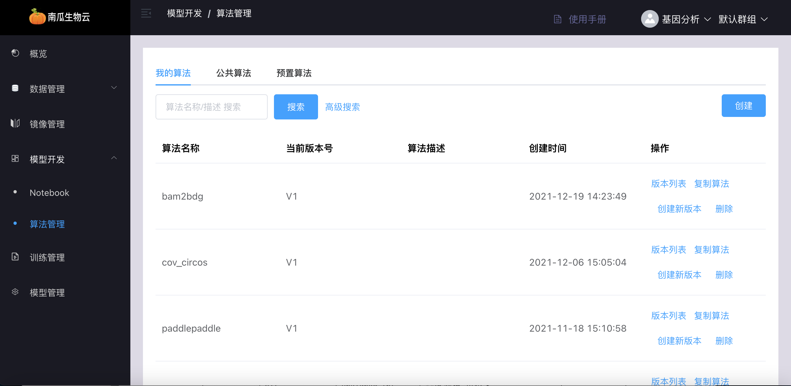

### 我的算法版本列表查询

我的算法版本列表中可看到我创建的某个算法的所有版本信息，通过点击要查看的算法的“版本列表”按钮进入。

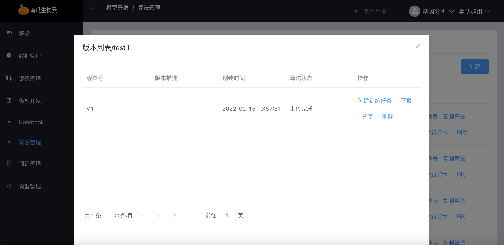

### 创建我的算法

点击算法管理界面的“创建”按钮进入。通过填写算法基本信息创建算法，包括以下参数。用户可选择是否创建算法时立即上传代码，注意上传代码只能选择 zip 格式的压缩包。

| 参数           | 描述                                                          |
|---------------------|----------------------------------------------------------------------|
| `算法名称`      | 不可与我的其他算法名称重复                   |
| `模型类别`      | 描述算法用途                   |
| `算法框架`      | 描述算法框架                  |
| `模型名称`  | 用于以后使用该算法创建训练任务，生成的模型名称                       |
| `算法描述`      | 用于描述该算法功能、用途等                                |

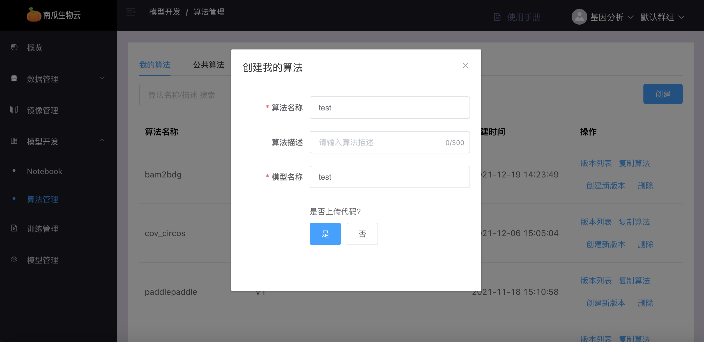

### 编辑我的算法

点击编辑按钮，对用户创建的算法中的模型类别，框架类型，算法描述进行编辑

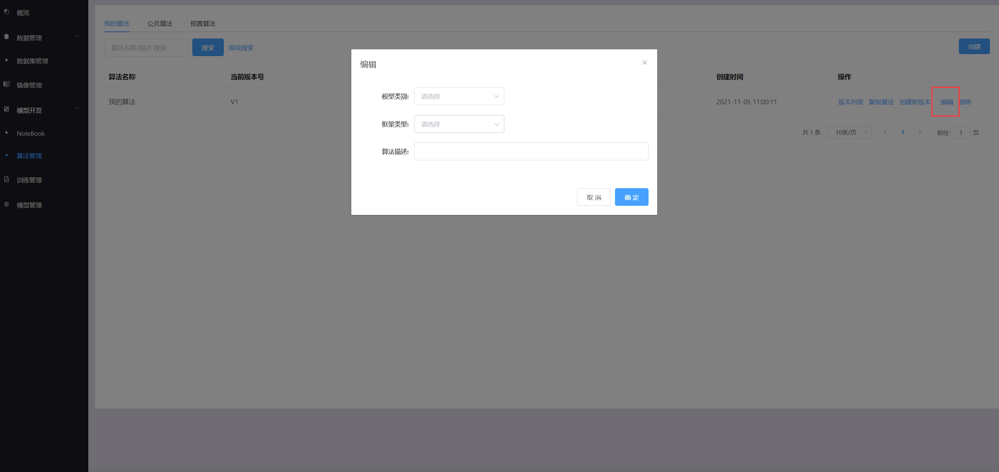

### 创建我的算法版本

当用户创建算法时，上传的算法代码被系统识别为版本1，此后用户可以在某一版本的基础上创建新版本，创建完后的新版本号为当前最新的版本号加1。创建新版本不需要上传代码，系统自动将基础版本的代码拷贝一份，作为新版本的代码使用。通过点击需要创建新版本的算法栏的“创建新版本”按钮进入。

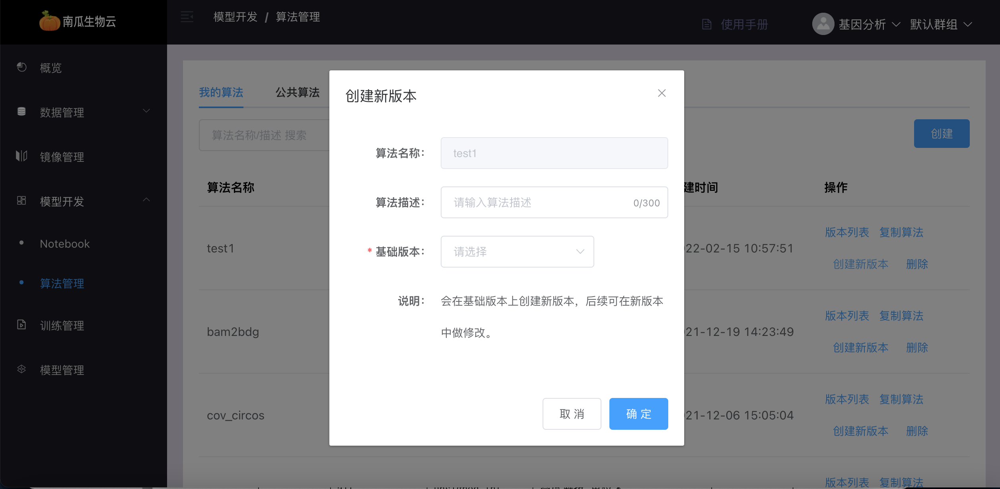

### 分享我的算法版本

分享我的算法版本将使我的算法版本在当前空间内变为公共算法，在该空间内的用户都可以在公共算法列表中查询到该算法，其他用户可复制、下载和使用该公共算法。通过点击版本列表中的“分享”进入。

### 取消分享我的算法版本

将取消分享的我的算法版本，其他用户不能继续在公共算法列表中查询到该算法，但用户已经复制的公共算法不受影响。通过点击版本列表中的“取消分享”进入。

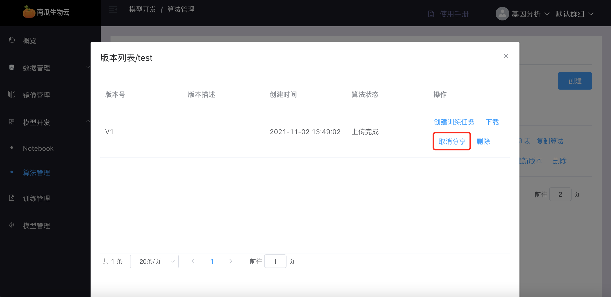

### 删除我的算法版本

删除我创建的算法的某一版本，删除后将不能够继续查询到该算法版本，也不能再继续使用该算法版本。通过点击版本列表中的“删除”进入。

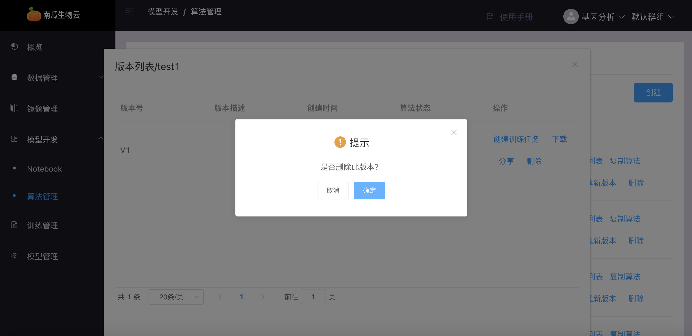

### 删除我的算法

删除我创建的某一算法，删除后该算法的所有版本也将被删除。将不能够继续查询到该算法，也不能再继续使用该算法的任一版本。通过点击算法管理界面中该算法栏的“删除”进入。

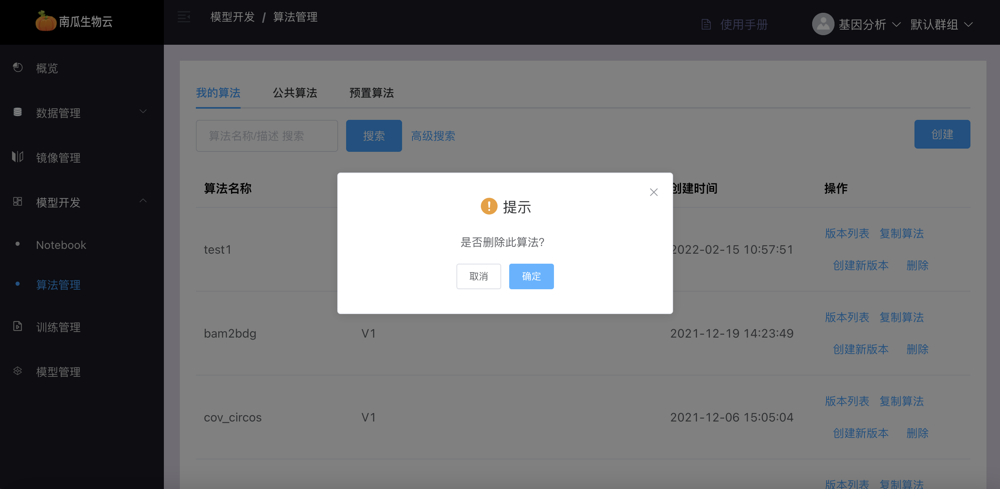

### 下载我的算法版本

将我的算法的某一版本的代码包以 zip 压缩包的格式下载到用户浏览器，下载的代码是用户最新保存的代码。通过点击版本列表中的“下载”进入。

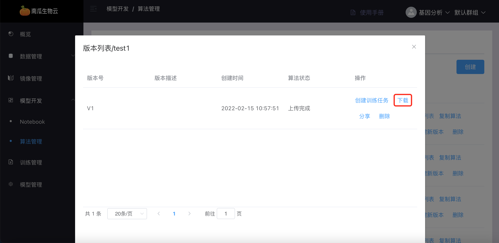

### 创建训练任务

使用我的算法的某一版本的代码创建训练任务，该训练任务可以生成模型或者调试算法代码。具体参考用户手册中的训练管理章节。通过点击版本列表中的“创建训练任务”进入。

## 公共算法

公共算法是指用户共享的算法，用户将自己创建的算法分享后，其他用户可使用。其他用户可以查询公共算法列表和复制公共算法版本。

### 公共算法列表

公共算法列表中可看到所有公共算法基本信息。

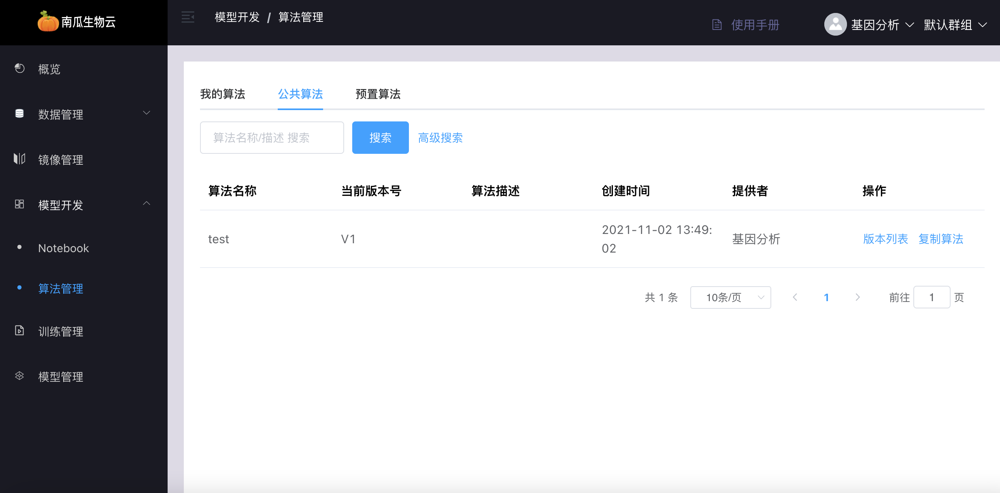

### 复制公共算法版本

用户可将某公共算法的某一版本进行复制，复制后可在我的算法列表中查询到该算法，并可对其进行使用和修改。

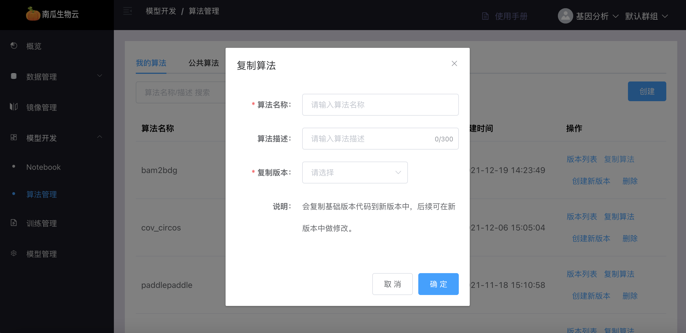

## 预置算法

预置算法是指系统提供的算法，预置算法由管理员创建，用户只有使用权限。用户可以查询预置算法列表和复制预置算法版本，具体操作方式和公共算法类似，此处不再赘述。

