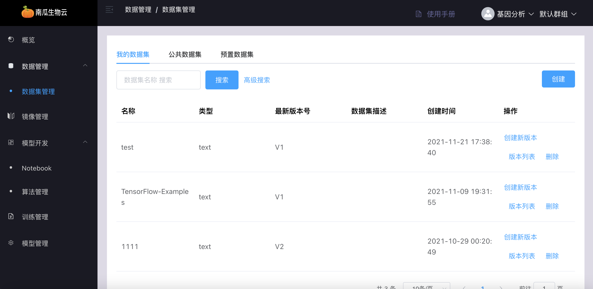
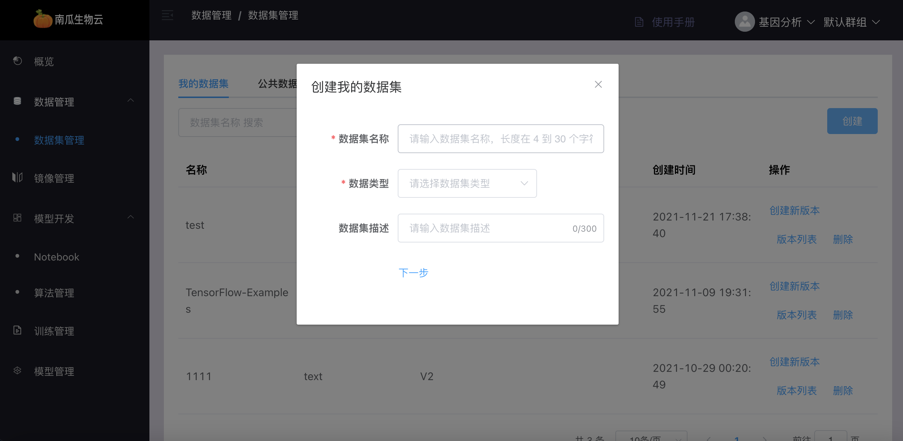
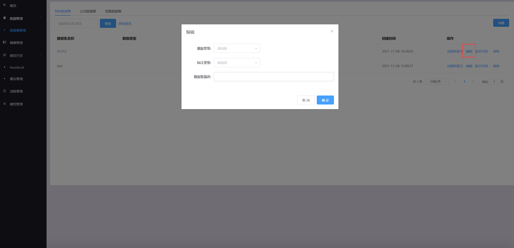
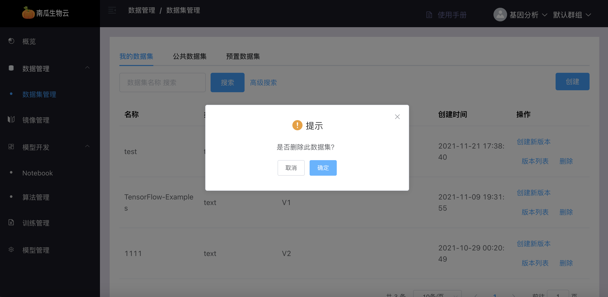
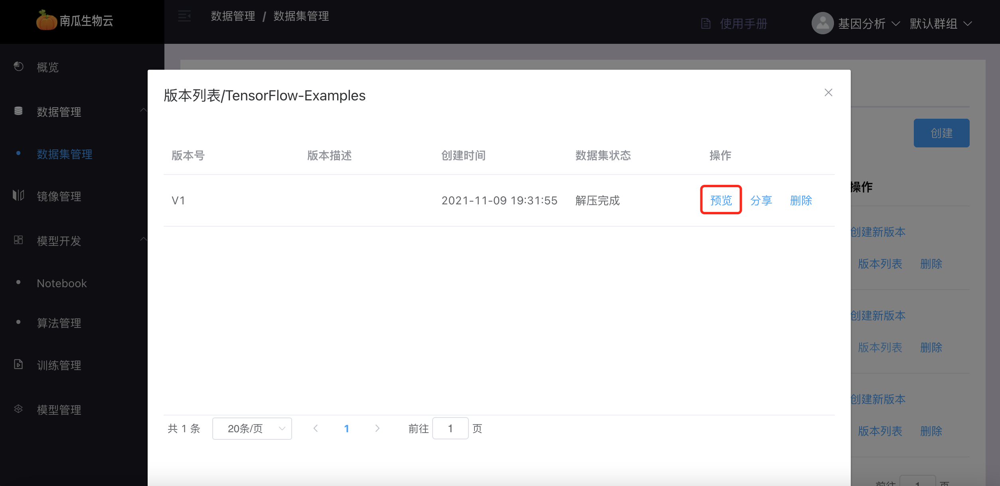
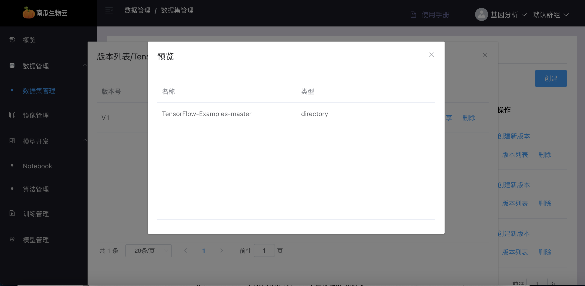
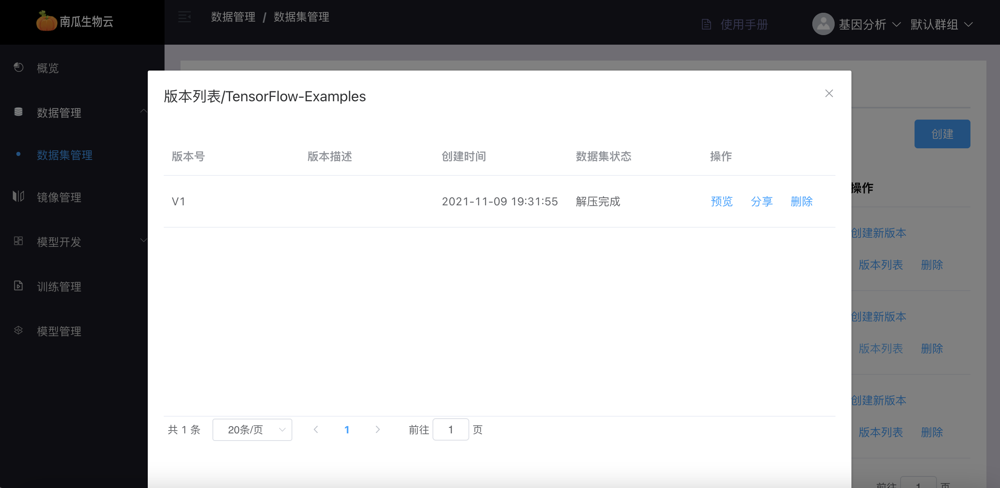
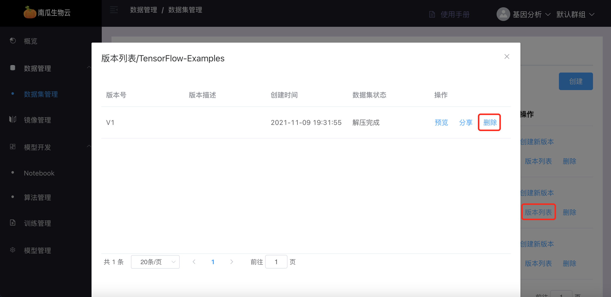

# 数据管理

数据管理分为我的数据集、公共数据集和预置数据集。我的数据集是用户自己的数据集，公共数据集是用户分享的数据集，预置数据集是管理员上传的数据集

## 数据集列表

点击我的数据集/公共数据集/预置数据集按钮，可查看对应数据集列表

## 创建数据集

点击创建按钮，填入相关信息并上传数据集压缩包，点击确定创建数据集

## 编辑数据集

点击创建按钮，可以对数据集类型，标注类型。数据集描述进行编辑

## 删除数据集

点击删除按钮，删除数据集

## 创建新版本

点击创建新版本按钮，填入相关信息并上传数据集压缩包，点击确定创建新版本

## 版本列表

点击版本列表按钮，查看数据集版本列表

## 预览版本

点击预览按钮，查看版本的文件目录

## 分享版本

点击分享按钮，分享数据集到「公共数据集」

## 删除版本

版本列表里点击删除按钮，删除版本

