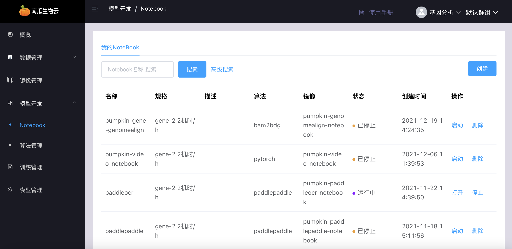
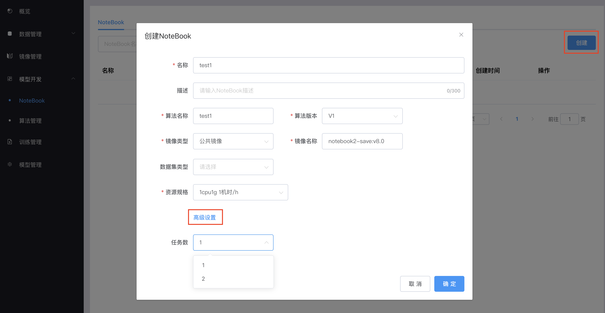
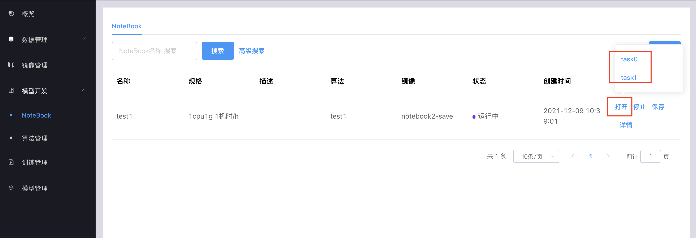
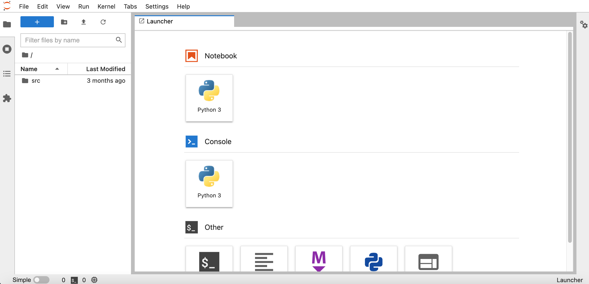
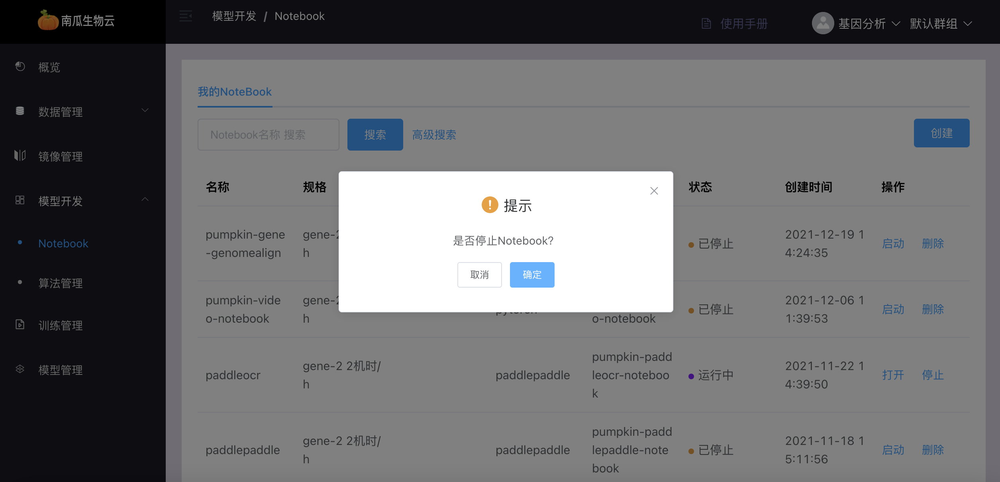
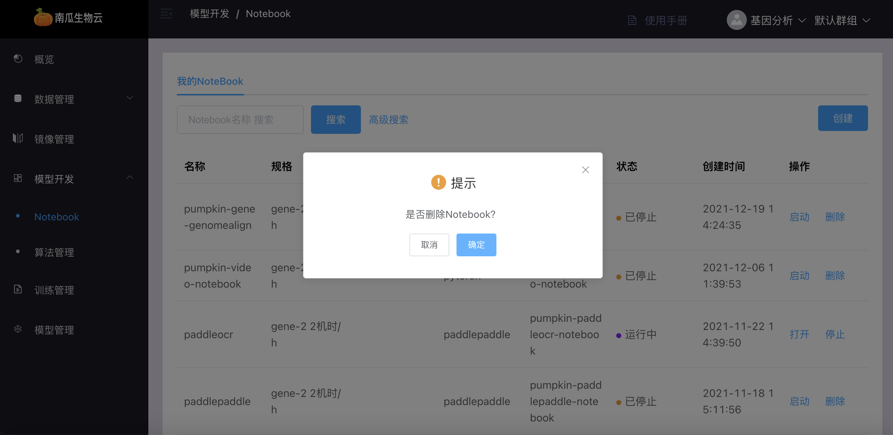
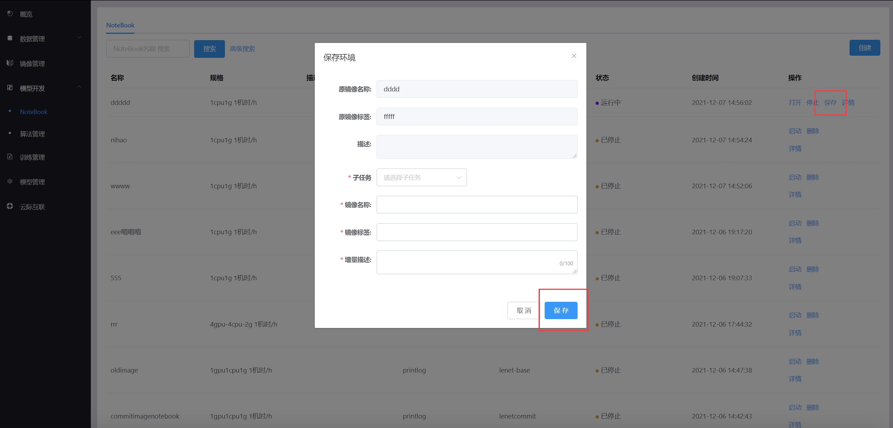
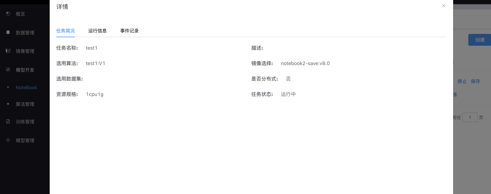
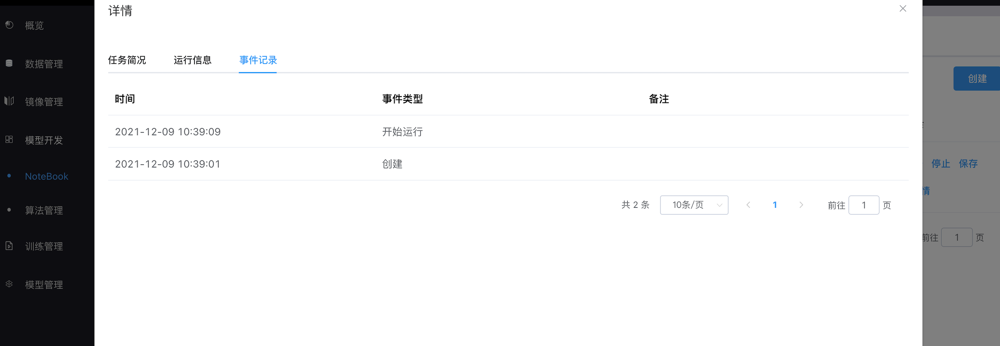

# 模型开发

## notebook管理

notebook 管理提供在线编程环境，用来调试、运行和保存算法以支撑后续的模型训练。该模块支持开源的 JupterLab，用户制作 notebook 类型的镜像时需要参考[这里](../develop/notebook_image.md)。用户可以创建、打开、启动、停止、删除 notebook，用户在 JupterLab 里编辑算法将会自动保存

:::note

- notebook会将算法、数据集分别挂载到/code、/dataset目录，因此 notebook 镜像需要不占用/code、/dataset目录
- 用户如果没有进行停止操作，notebook 默认 2 个小时会自动停止以释放资源给更多的人使用

:::

### notebook列表

notebook 列表可分页查看 notebook 信息

### 创建notebook

点击创建按钮，选择相应镜像、算法和数据集（可选），可在「高级设置」中选择任务数，点击确定创建 notebook。

### 打开notebook

点击打开按钮，弹出悬浮窗，选择对应子任务，打开 notebook

### 停止notebook

点击停止按钮，停止 notebook

### 删除notebook

点击删除按钮，删除 notebook

### 保存镜像

点击保存按钮进入保存镜像对话框，选择子任务名称，镜像名称，标签，增量描述，点击保存按钮

### notebook详情

点击详情按钮，可分别查看「任务简况」、「运行信息」、「事件记录」

点击下拉框，选择子任务查看对应运行信息

查看notebook任务启停事件记录

