# 镜像管理

:::note
此处镜像是指 Docker 格式的容器镜像．
:::

镜像是算法运行的载体，镜像以容器的方式启动，提供运行程序的环境．

镜像管理模块包括用户镜像管理与预置镜像管理.

镜像来源分为两类：远程镜像地址与上传镜像包，其中：

- 远程镜像地址为 Dockerhub 或者其他镜像仓库中的镜像地址；
- 上传镜像包是指通过`docker save`命令将镜像保存成`tar`格式压缩包，再上传；

## 我的镜像

我的镜像是指用户自己创建的镜像，只有用户自己才能查看与使用．

我的镜像管理主要功能包括：我的镜像列表与查询，创建镜像，分享镜像，取消分享镜像,修改镜像描述，删除镜像．

### 我的镜像列表

用户可以在我的镜像列表中查看自己创建的镜像信息．

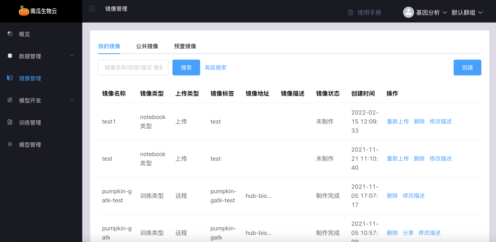

### 创建镜像

通过填写镜像基本信息创建镜像，其中：

镜像来源分为通过远程镜像地址与上传镜像包．

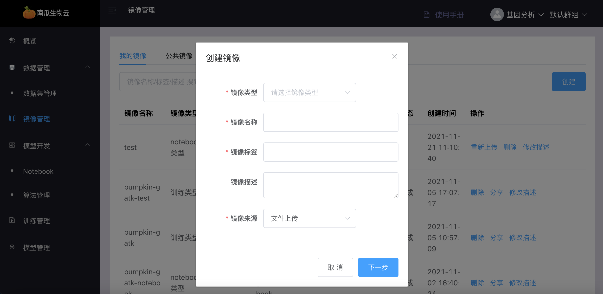

其中创建远程镜像需要填写远程镜像地址，如下：

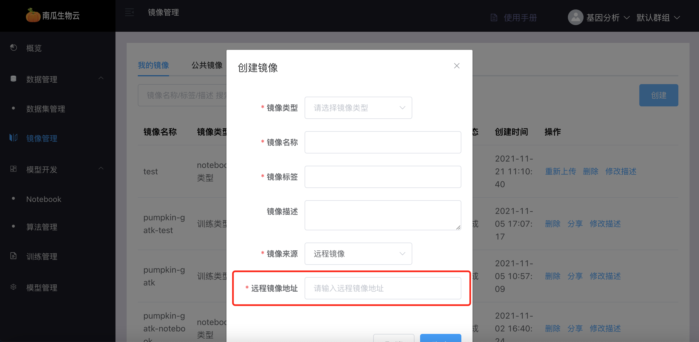

通过上传镜像包方式创建镜像需要先将镜像导出成镜像压缩包，例如：

```shell
docker save nvcr.io/nvidia/tensorflow:21.07-tf2-py3　-o nvidia-tensorflow21.07-tf2-py3.tar
```

而后通过填写上传镜像信息，在`下一步`后选择镜像压缩文件上传，如下：

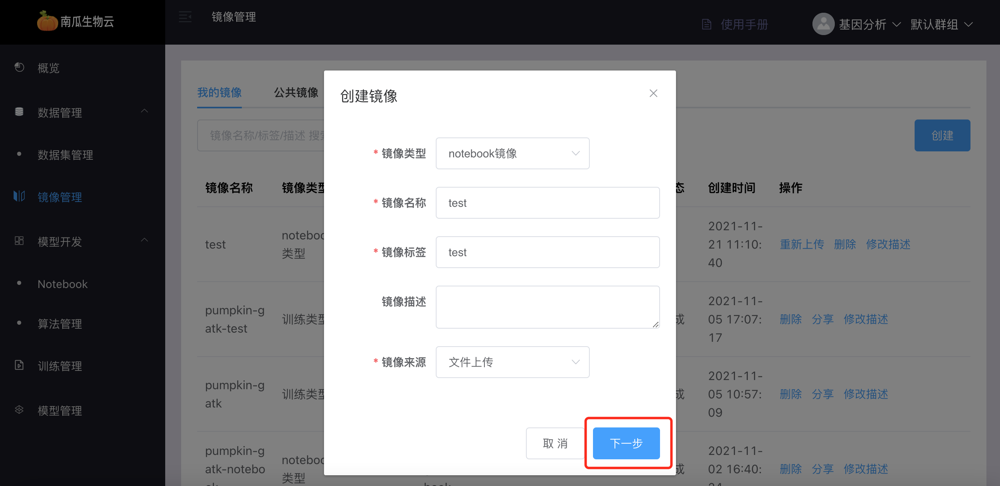

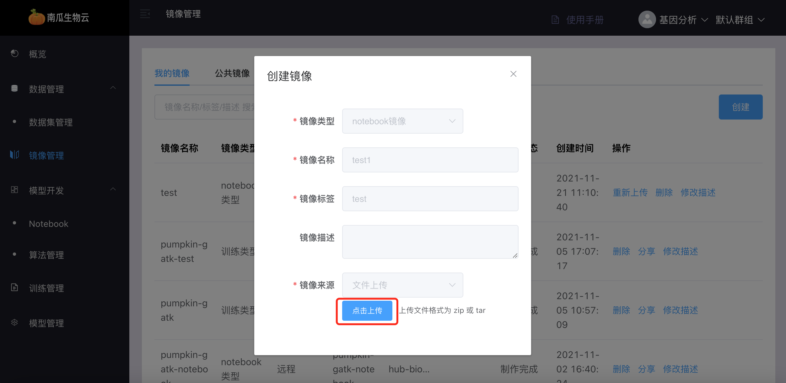

### 分享镜像

分享镜像是指用户将自己的镜像分享给其他用户使用，除用户自己外所有用户可以查看与使用镜像，用户可以在公共镜像中查询．

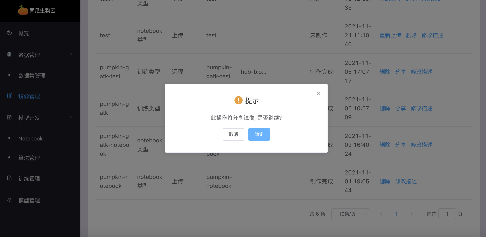

### 取消分享镜像

取消分享镜像是指用户将已经分享的镜像进行取消，取消分享以后该镜像将不会出现在公共镜像的列表中．

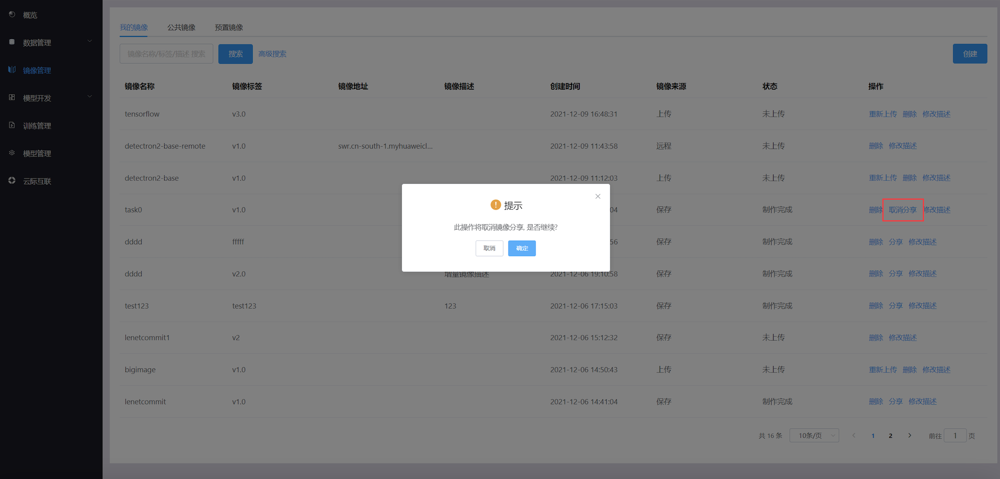

### 修改镜像描述

修改镜像描述信息，可方便用户了解镜像用途．

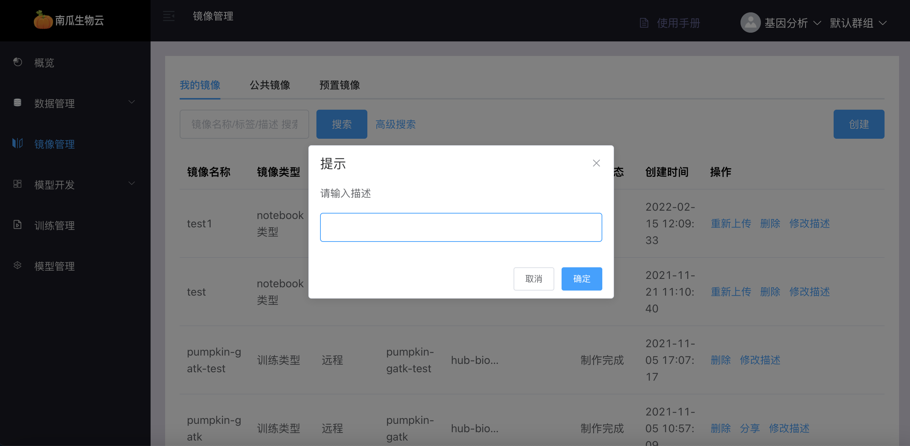

### 删除镜像

镜像一旦删除将无法恢复．

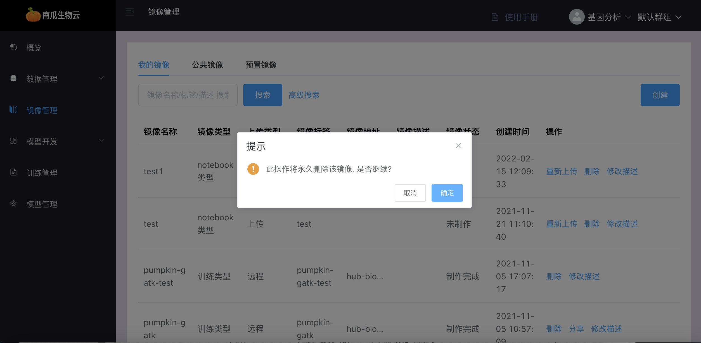

## 公共镜像

公共镜像是指用户共享的镜像，用户将自己创建的镜像分享后，其他用户可使用．

公共镜像管理主要功能包括：公共镜像列表与查询．

### 公共镜像列表

公共镜像列表中可看到所有公共镜像基本信息．

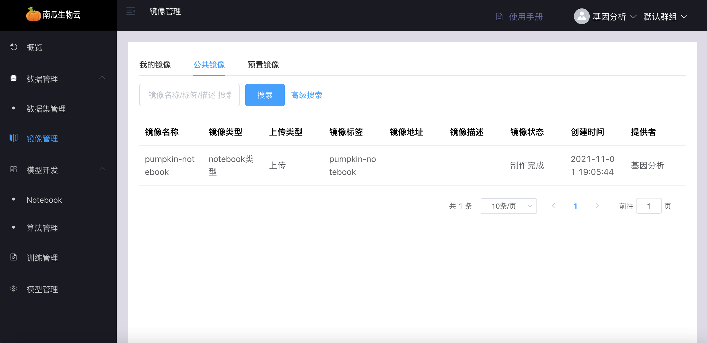

## 预置镜像

预置镜像是指系统提供的镜像，预置镜像由管理员创建，用户只有使用权限．

预置镜像管理主要功能包括：预置镜像列表与查询．

### 预置镜像列表

预置镜像列表中可看到所有预置镜像基本信息．

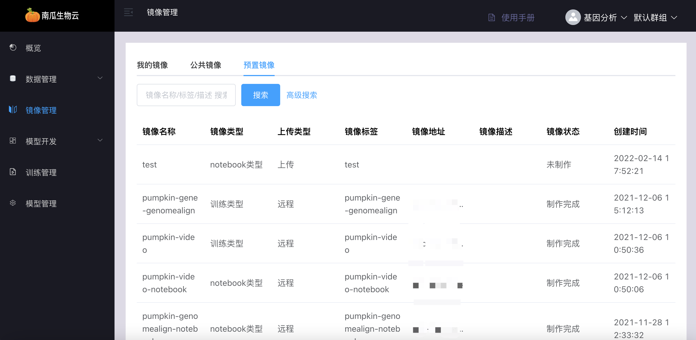

