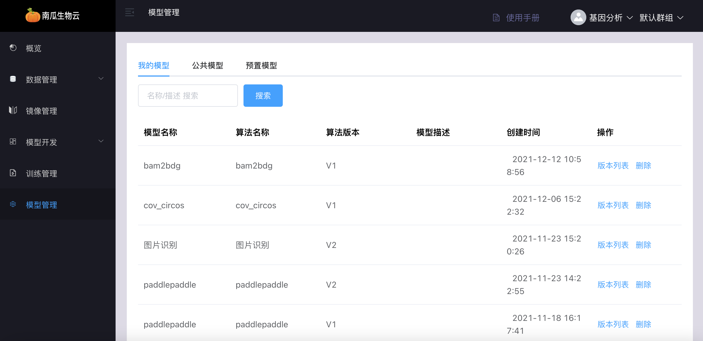
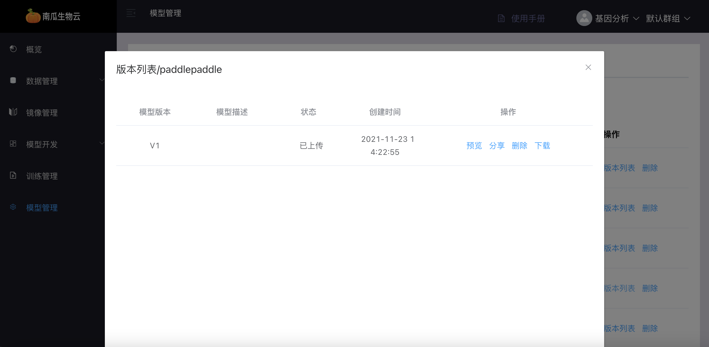
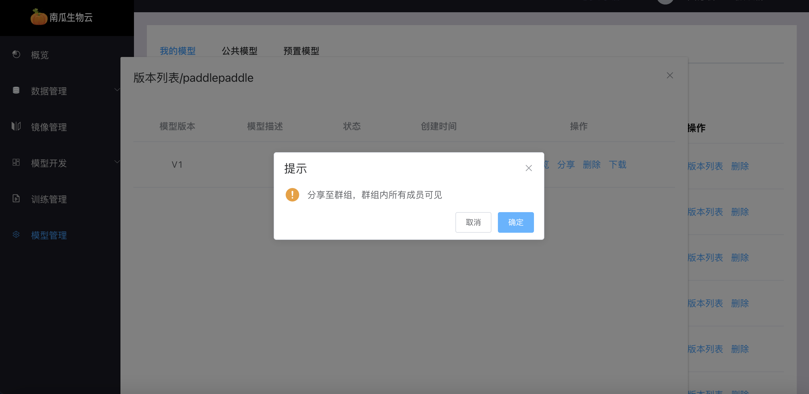
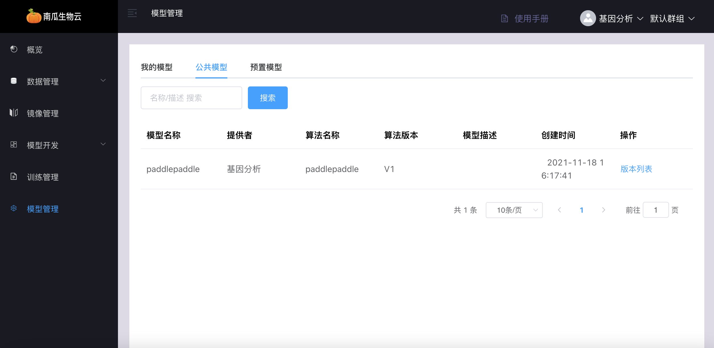
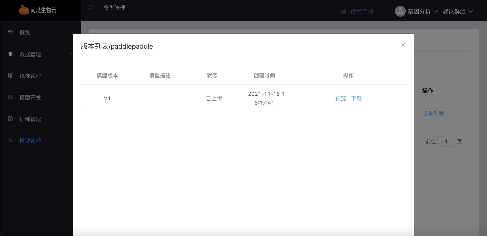
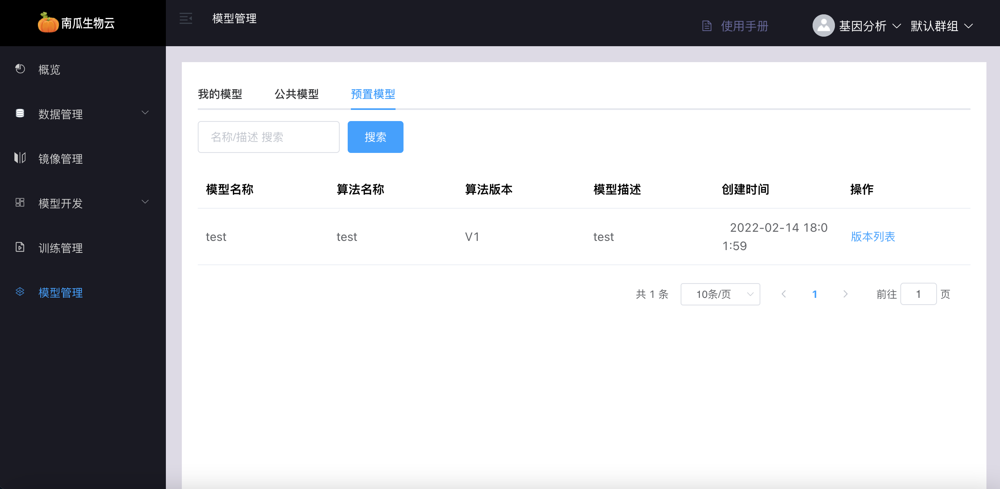
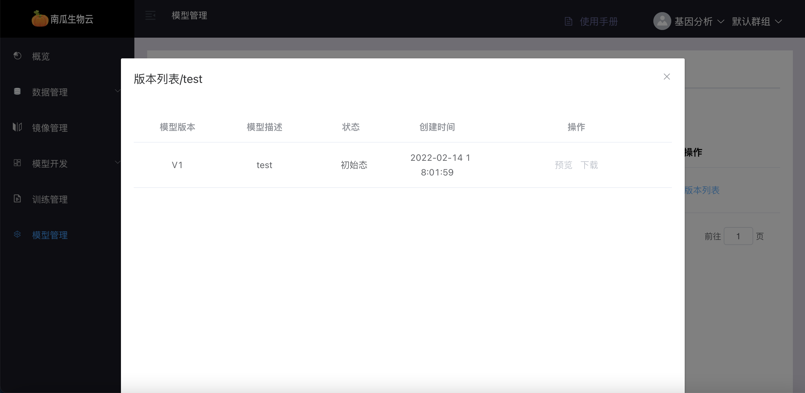

# 模型管理

模型是算法训练产生的结果，通过管理可以帮助用户归档，并为后续的模型验证和部署提供基础条件。

模型管理模块包括`我的模型`、`公共模型`与`预置模型`。

## 我的模型

我的模型是指自己在当前群组中通过算法训练得到的模型。

### 我的模型列表

我的模型列表中可看到我在当前群组中创建的所有模型信息。

### 我的模型版本列表

我的模型版本列表中可看到单个模型的所有版本信息，包括模型的分享、预览、下载和删除

- 分享：可以将我的模型版本分享给同个群组中其他成员，对其可见

- 预览：可以查看模型的文件夹结构及内容

- 下载：可以把算法训练后的模型文件压缩包下载下来，方便在其他地方使用

- 删除：可以把对应的模型版本删除掉，删除后不可恢复

## 公共模型

公共模型是指在当前群组中，群组成员分享出来的自己通过算法训练得到的模型，当前用户只有使用权限。

### 公共模型列表

公共模型列表中可看到所在群组中所有成员分享出来的的所有模型信息。

### 公共模型版本列表

公共模型版本列表中可看到单个模型的版本信息，包括模型的`预览`、`下载`

- 预览：可以查看模型的文件夹结构及内容

- 下载：可以把所在群组中其他成员分享的模型文件压缩包下载下来，方便在其他地方使用

## 预置模型

预置模型是指向用户提供的模型，预置模型由管理员创建，用户只有使用权限。

### 预置模型列表

预置镜像列表中可看到所有预置模型基本信息。

### 预置模型版本列表

预置模型版本列表中可看到单个模型的版本信息，包括模型的`预览`、`下载`

- 预览：可以查看模型的文件夹结构及内容

- 下载：可以把所在群组中其他成员分享的模型文件压缩包下载下来，方便在其他地方使用

