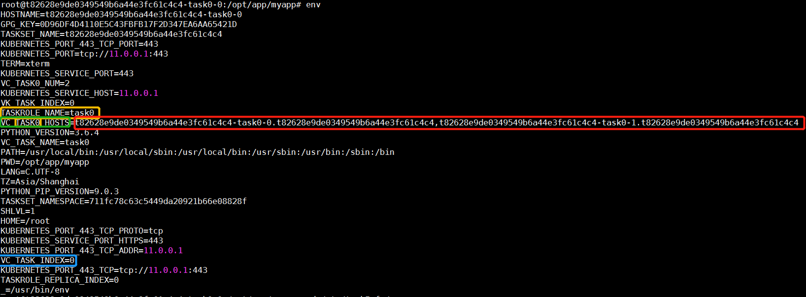

# 训练管理

「南瓜生物云一站式开发平台」支持用户创建分布式训练任务和非分布式训练任务两种方式。其特点如下：

1. 多子任务高可靠性。南瓜生物云的分布式训练任务模式支持其拥有若干个子任务，且每个子任务可以拥有多个相同的副本，启动训练时南瓜生物云会为每个子任务及其副本都单独分配一个虚拟容器进行训练，不同子任务之间相互隔离，互不干扰，提高了训练任务的可靠性。多个子任务副本数量，不仅保证成功率，也可通过指定子任务是否为主任务的方式，在主任务成功时，快速完成训练。
2. 支持多用户资源隔离。为了满足科研单位或者公司中不同工作组的不同资源需求，南瓜生物云提出了“工作空间”概念，即通过划分不同工作空间并匹配相应的训练资源，为工作空间的管理员对工作空间内训练资源的管理提供便利性。
3. 兼容多个深度学习计算框架。训练任务支持 TensorFlow、PaddlePaddle、MindSpore、PyTorch 等多种深度学习框架，用户使用预置算法或自定义算法及镜像进行云端训练。
4. 支持「训练-模型」一站式开发。支持在训练任务完成并成功后，一站式自动保存模型，方便部署调用。        
5. 可重用性好。支持训练任务模板保存与在线编辑，方便用户根据训练任务模板再次提交训练任务。

:::note

- 根据界面提示，填写好训练任务的有关参数后，训练管理模块会自动将用户所选取的算法、数据集将分别挂载到/code、/dataset 目录，**注意**用户训练完成后，模型将自动保存在平台所提供的/model目录下，而这个**前提**需要用户在主代码中指定模型保存路径，形如：/model/save.pth。

- 为实现分布式子任务及其副本之间的通信，需要用户在代码中执行如下步骤(**注意变量名称是大写字母**)，获取各个子任务运行环境所在节点的 ip：

   1、获取该任务所运行环境中的环境变量 **TASKROLE\_NAME** 的变量值（该值为 Pumpkin 系统中子任务的名称，与用户界面所填写的子任务名称无关）；

   2、根据第一步中获取的**TASKROLE\_NAME**的变量值 ，并**拼读**环境变量中 **VC\_{TASKROLE\_NAME}\_HOSTS**的变量值，该值存放该子任务下所有副本的ip；

   3、读环境变量 **VC\_TASK\_INDEX**，可得当前 pod 的 ip 为第 2 步得到的 ip 列表的第几个（从第 0 个算起），用户自行按需获取；

   4、完成分布式任务间通信。

- 分布式任务中环境变量示例

图中分布式任务的 id 为 t82628e9de0349549b6a44e3fc61c4c4，其含有 1 个子任务且该子任务有 2 个副本，系统中子任务名称表示为 task0，副本名称分别为 task0-0,task0-1，如下图所示：

:::

## 训练管理操作流程

训练管理流程图：

训练管理模块主要有两部分：

1. 训练任务的创建、单个删除、批量删除、查询（支持模糊查询和高级查询）等功能。  
2. 训练任务模板的创建、单个删除、批量删除、模板复制,查询（支持模糊查询和高级查询）等功能。

这里主要介绍如何创建训练任务和任务模板。我们先从创建训练任务开始：

## 创建训练任务

**1.** 数据准备：在创建训练任务之前，请确保已经准备好训练任务需要使用的数据集、可用的镜像和相应的算法。具体参考：

- [创建数据集](./data.md)
- [notebook环境调试算法](./deployment.md)
- [上传算法](./algorithm.md)

**2.** 点击右上角「创建任务」按钮，在弹出「创建训练任务」窗口中写入信息。

当任务是非分布式任务的时候，窗口如下：

当任务为分布式任务时，窗口如下：

点击【添加】，可以为该训练任务添加若干个子任务：

**训练任务界面的参数介绍如下**：

1. 输入任务名称，支持字母、数字、汉字、英文横杠和下划线，最多 30 个字符。
2. 添加任务描述（可选）。
3. 选择算法的类型，可选「我的算法」或「预置算法」或 「公共算法」。
4. 选择算法，此下拉框的内容会根据选用的算法类型、名称和版本变化。
5. 选择镜像类型，支持 「我的镜像」或「预置镜像」或 「公共镜像」。
6. 选择镜像，此下拉框的内容会根据选用的镜像类型、名称和版本变化。
7. 选择数据集类型，支持 「我的数据集」或「预置数据集」或 「公共数据集」。
8. 选择数据集，此下拉框的内容会根据选用的镜像类型和名称变化。
9. 选择是否是分布式任务。如果是分布式任务，输入子任务名称，子任务运行命令，子任务运行参数，子任务资源规格，子任务副本个数及其最小成功数、最小失败数，以及设置子任务是否为该分布式总任务的主任务。
10. 输入运行命令，如： python mnist.py。如果将所有运行参数都写在运行命令中，例如：python mnist.py --ouput  res.json，则无需在 key-value 中填写。
11. 选择运行参数模式，支持 key-value 模式，南瓜平台会为每个参数转换命令为： --key = value。
12. 选择资源规格，不同的用户空间，资源规格不同，且资源规格对应不同的机时消费，用户根据实际情况按需选取。
13. 1-12 步完成了训练任务信息的填写，此时可以选择「开始训练」触发创建训练任务操作，也可以选择「保存模板」，将此次填写信息保存为模板，并从「任务模板」中触发训练任务操作。
14. 提供运行参数预览功能，方便用户及时判断训练任务结果是否有效。

**训练管理模块主要功能介绍：**

1、支持用户创建分布式和非分布式任务。

2、支持任务模板信息保存。

3、支持任务的删除和批量删除。注意只有任务在终止状态（成功、失败、停止状态）方可触发删除和批量删除动作。

4、支持任务的实时停止。

5、支持任务详情的实时查看。包括任务简况、子任务副本、子任务日志查看与下载、任务负载实时查看。

## 训练任务模板

1、创建训练任务模板，该过程等同于创建训练任务，可参考上述训练任务参数介绍。

2、提供任务模板编辑功能，完成该任务模板的更新操作。方便用户调整算法、镜像、数据集等相关信息。模板更新后，可及时保存。

3、用户可以通过已创建好的模板，直接创建训练任务。

4、支持任务模板的删除和批量删除功能。

5、支持任务模板复制功能。
