---

sidebar_position: 1
---

# 目标检测模型训练

## 概述

本示例以Detectron2算法为例演示在本平台进行目标检测模型训练的全过程。Detectron是Facebook AI研究院(FAIR)于2018年初公开的目标检测平台，包含了大量业内最具代表性的目标检测、图像分割、关键点检测算法。

detectron2项目的github地址：https://github.com/facebookresearch/detectron2。

detectron2算法学习参考：https://detectron2.readthedocs.io/en/latest/tutorials/install.html。

在本平台进行模型训练的流程如下：

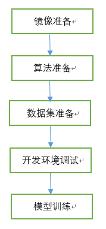


## 镜像准备

1、根据Detectron2算法对环境要求，[这里](https://ngc.nvidia.com/catalog/containers/nvidia:pytorch/layers)找合适的基础镜像

2、下载镜像和构建容器的方式可参考[这里](https://blog.csdn.net/chqfeiyang/article/details/89674055/)

3、在容器中安装Detectron2算法需要的一些组件

4、将容器打包成镜像，执行docker commit命令

```
docker commit d5944567401a detectron2-base:v1.0
```

其中，d5944567401a是步骤2中启动的容器的id。

5、将镜像保存为本地文件，可以使用Docker save命令

```
docker save -o detectron2-base-v1.0.zip detectron2-base:v1.0
```

6、上传镜像到本平台

登录平台，点击【镜像管理】菜单，在【我的镜像】页面，点击【创建】，如下图所示。进入我的镜像创建页面。

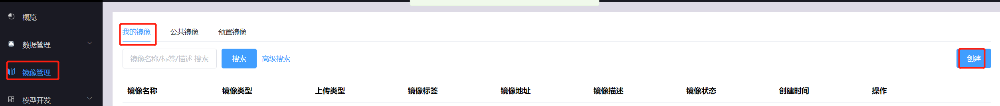


**镜像上传**

镜像用于在模型开发或者训练时创建开发或者训练任务容器。如下图，镜像来源选择”文件上传“，点击【下一步】，上传步骤5中保存的detectron2-base-v1.0.zip，上传完成后，点击【确定】，镜像创建成功。

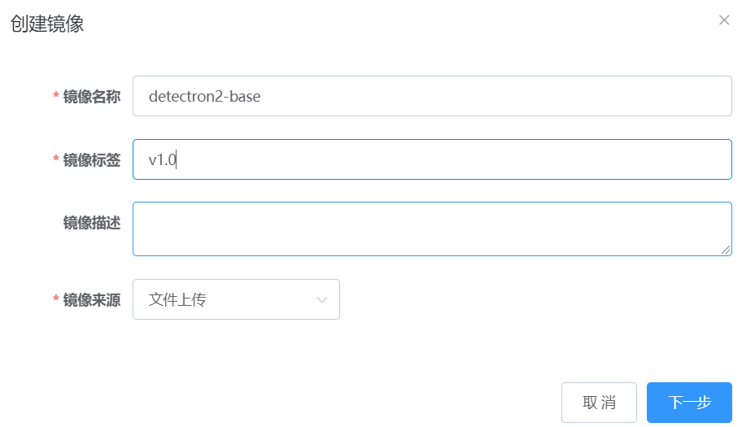


**模型开发镜像制作**

本平台的Notebook开发环境使用开源的 JupyterLab，需要用户自行制作安装了 JupyterLab的镜像。

可以基于上述步骤4中制作的基础镜像，在此基础上安装jupyterlab，制作Notebook镜像。

参考的dockerfile如下：

```
FROM detectron-base:v1.0 
RUN pip3 install jupyterlab
CMD ["sh","-c", "jupyter lab --no-browser --ip=0.0.0.0 --allow-root --notebook-dir='/code' --port=8888 --LabApp.token='' --LabApp.allow_origin='*' --LabApp.base_url=$PUMPKIN_JPY_BASE_URL"]

```

制作镜像的命令如下：

```
docker build -f /home/jupyter-dockerfile -t detectron2-base-notebook:v1.0 .
```

保存镜像的命令如下:

```
docker save -o detectron2-base-notebook.zip detectron2-base-notebook:v1.0
```

镜像文件制作完成，可以使用上面的上传部署上传镜像到平台。

**镜像查看**

可以在【镜像管理】->【我的镜像】页面查看到刚刚上传的镜像。刚刚上传的镜像，状态会处于“制作中”。刷新页面，镜像制作完成后，状态显示为”制作成功“，如下图所示，表示镜像上传成功。

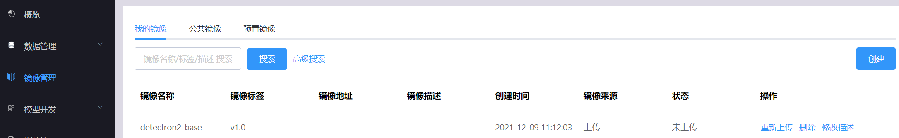


7、使用华为云镜像仓库镜像

为方便初学用户，我们制作好了detectron2算法的训练基础镜像，并放在华为云镜像仓库，包括安装了Jupyterlab的基础镜像(`yiluxiangbei/yunqiicpumpkin/detectron-base-notebook:v1.1`，可以用于模型开发，也可以用于模型训练)和未安装Jupyterlab的基础镜像(`yiluxiangbei/yunqiicpumpkin/detectron-base:v1.0`，只能用于模型训练)。

初学用户可以跳过1-6步，使用华为云镜像仓库的镜像来创建本平台的远程镜像。

**创建远程镜像**

点击【镜像管理】菜单，在【我的镜像】页面点击【创建】，进入创建镜像页面。在镜像创建页面，镜像来源选择”远程镜像“，填写远程镜像地址，点击【确定】，镜像创建成功。

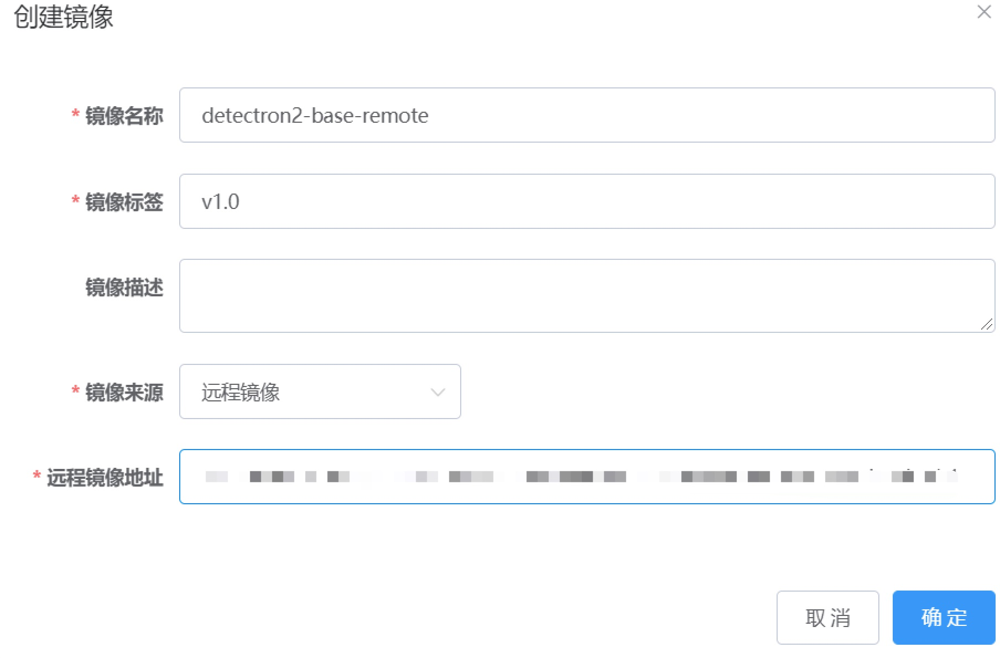


**通过远程镜像创建的镜像的使用方式与步骤6中通过文件上传的方式创建的镜像相同。**


## 算法准备

1、拉取代码到本地，编译，参考[这里](https://detectron2.readthedocs.io/en/latest/tutorials/install.html)。

2、将编译后的代码打包成.zip格式的压缩包

3、上传算法到平台

点击【模型开发】-【算法管理】菜单，在【我的算法】页面点击【创建】，可以打开创建我的算法页面。

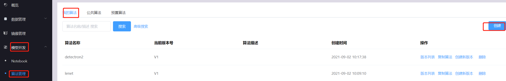


填写算法名称、模型类型、算法框架、描述和对应生成模型的名称，选择是否上传代码，选择“**是**”，现在上传算法代码。

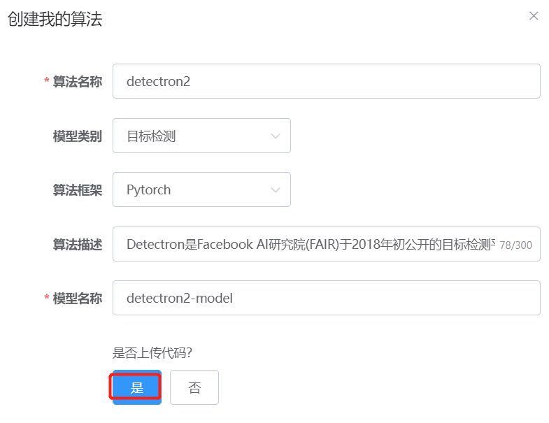

如下图点击【点击上传】按钮，选择步骤2中打包的zip文件进行上传。上传完成，点击【确定】，即可在【我的算法】页面中看到刚才上传的算法。

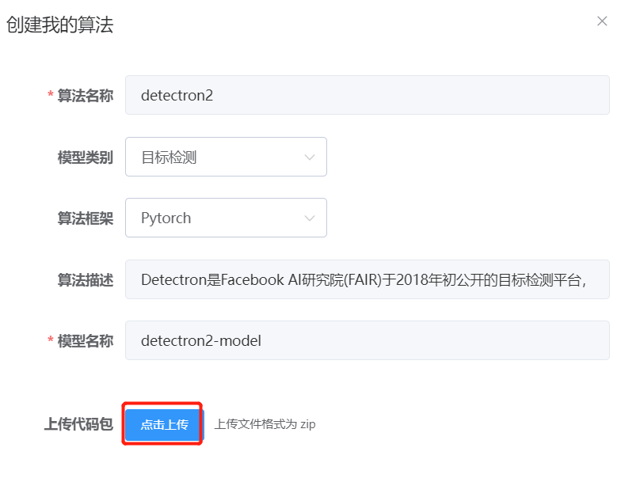

## 数据集准备

Detectron2算法使用MSCOCO2017数据集。下载MSCOCO2017.zip文件，上传至本平台。

点击【数据管理】->【数据集管理】菜单，在【我的数据集】页面，点击【创建】，进入数据集创建页面。

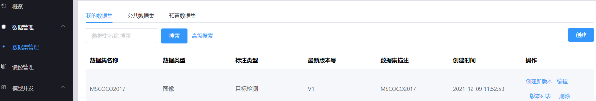

在创建页面填写数据集信息，点击【下一步】，然后点击【点击上传】，选择MSCOCO2017.zip文件，上传数据集。

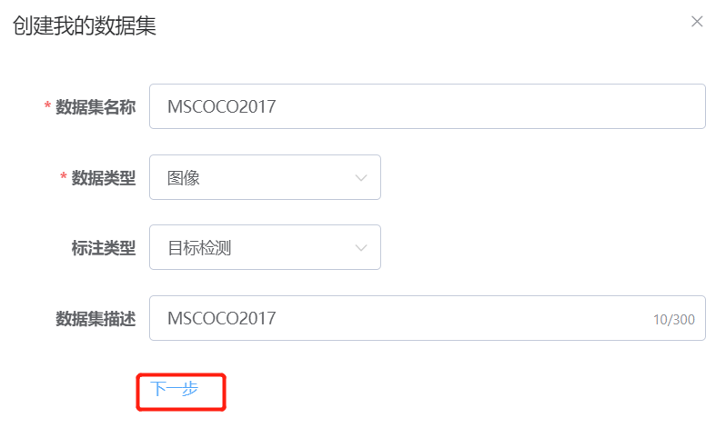

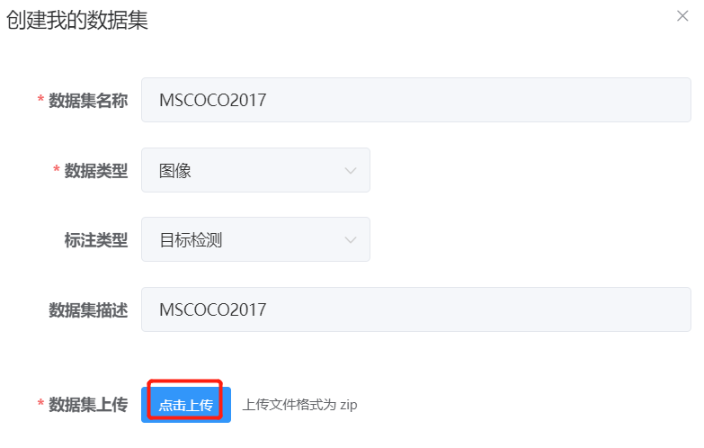

## 开发环境调试

平台提供在线编程环境，用来调试、运行和保存算法以支撑后续的模型训练，支持开源的 JupterLab。用户可以使用安装过了Jupyterlab的预置镜像来创建Notebook开发环境，也可以自行制作安装了Jupyterlab的镜像，参考[这里](../../develop/notebook_image.md)。用户可以创建、打开、启动、停止、删除Notebook。用户在 JupyterLab 里编辑的算法将会自动保存。

:::note

- Notebook会将算法、数据集分别挂载到/code、/dataset目录，因此 Notebook 镜像需要不占用/code、/dataset目录
- 用户如果没有进行停止操作，Notebook 默认 2 个小时会自动停止以释放资源给更多的人使用

:::

### 创建Notebook

如下图所示，点击【模型开发】-【Notebook】菜单，进入Notebook列表页面。

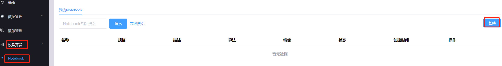


使用上述镜像准备步骤中上传的Notebook镜像detectron2-base-notebook来创建一个Notebook，如下图所示：

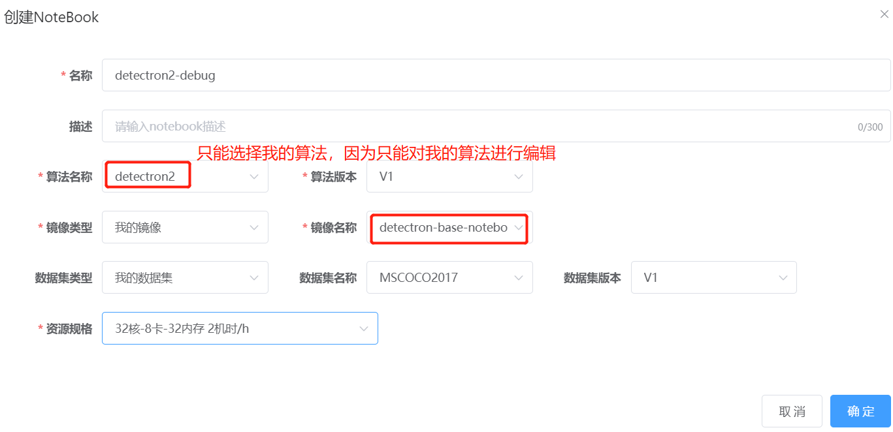

### 进入Jupyterlab

等待Notebook启动成功，Notebook状态为”**运行中**“，点击【打开】按钮，可以打开jupyterlab调试页面了。

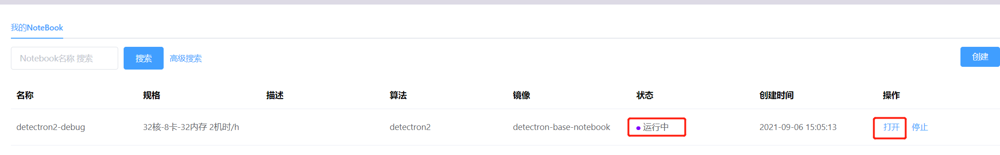


在jupyterlab页面，点击【Terminal】，进入终端页面。**进入/code目录，可以看到detectron2算法的代码，可以编辑代码。编辑后，保存文件，代码修改会自动保存到我的算法中的detectron2算法。保存的算法可以用于下一次的模型开发，也可以用于后续的模型训练。**

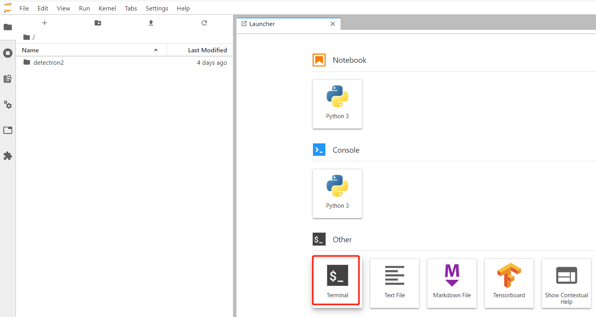


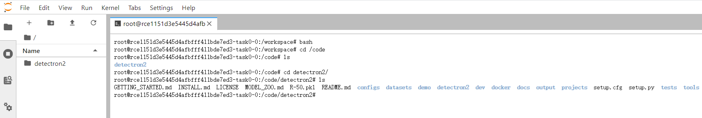


### 代码调试

1、数据集路径修改，官方参考文档在[这里](https://github.com/facebookresearch/detectron2/blob/master/datasets/README.md)

detectron2算法默认使用/your_path/coco/路径，而本平台默认将数据集挂载在目录/dataset下，建议采用软链接的方式来设置数据集路径，代码如下：

```
mkdir /datasets/coco;
ln -s /dataset/MSCOCO2017/annotations /datasets/coco/annotations;
ln -s /dataset/MSCOCO2017/train2017 /datasets/coco/train2017;
ln -s /dataset/MSCOCO2017/test2017 /datasets/coco/test2017;
ln -s /dataset/MSCOCO2017/val2017 /datasets/coco/val2017;
export DETECTRON2_DATASETS=/datasets
```

2、预训练模型下载

由于maskrcnn模型初始化需要从detectron2://ImageNetPretrained/MSRA/R-50.pkl加载预训练模型，而该地址可能访问超时。因此可将该文件下载至本地（[这里](https://dl.fbaipublicfiles.com/detectron2/ImageNetPretrained/MSRA/R-50.pkl)下载），然后将该文件上传至指定目录中，如：/code/detectron2目录下。

3、启动命令和参数配置，参考[这里](https://detectron2.readthedocs.io/en/latest/tutorials/getting_started.html)

参考启动命令如下：

```
cd /code/detectron2;
tools/train_net.py --num-gpus 2 --config-file configs/COCO-InstanceSegmentation/mask_rcnn_R_50_FPN_1x.yaml MODEL.WEIGHTS /code/detectron2/R-50.pkl SOLVER.MAX_ITER 4000  OUTPUT_DIR /model
```

--num-gpus：配置gpu卡数

MODEL.WEIGHTS：预训练模型路径

SOLVER.MAX_ITER：模型训练迭代次数，默认为4w 

 OUTPUT_DIR：将日志文件和保存的模型参数存于/model路径下

4、算法保存

在本开发环境中增加、删除和修改的文件都会自动保存到本调试的算法版本中。


## 模型训练

:::note

本平台的模型训练任务成功后，会将/model下的文件保存成模型，供用户预览和下载，所以在模型训练时请将输出目录设置为/model

:::

### 创建训练任务

点击【训练管理】菜单，进入训练任务列表页面，点击【创建任务】，进入训练任务创建页面。

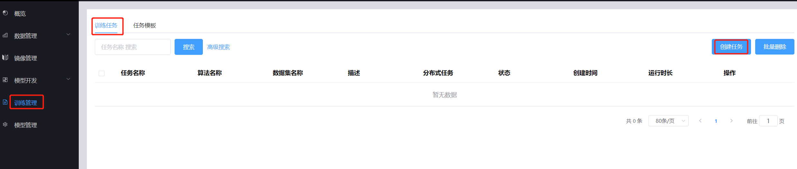

如下图所示填写训练任务名称，选择算法、镜像和数据集，填写运行命令，选择资源规格。其中，资源规格是本训练任务能够使用的cpu、gpu、内存和共享内存。点击【开始训练】，创建了一个训练任务。

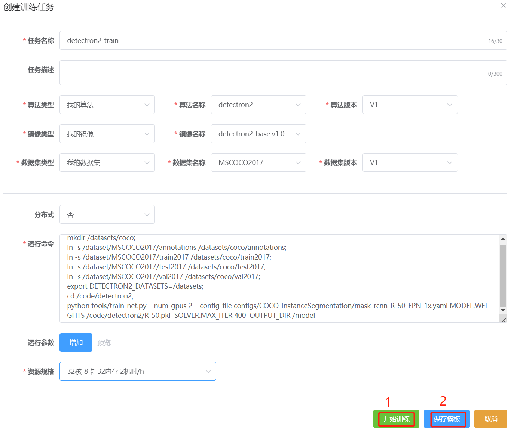

### 创建任务模板

如上图，在点击【开始训练】之前先点击【保存模板】，可以把填写的信息保存成一个训练任务模板，供以后从训练任务模板中直接创建相同配置的训练任务。

也可以直接从任务模板页面创建任务模板，如下图所示，点击【训练管理】菜单，在任务模板页面，点击【创建模板】，进入创建任务模板页面。

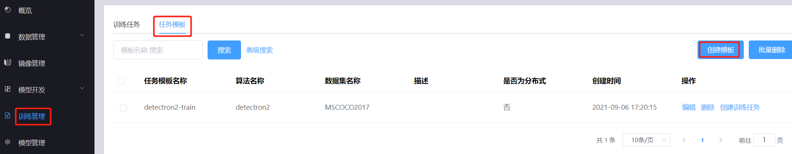

在任务模板页面，填写任务相关信息，点击【保存模板】，创建模板成功。

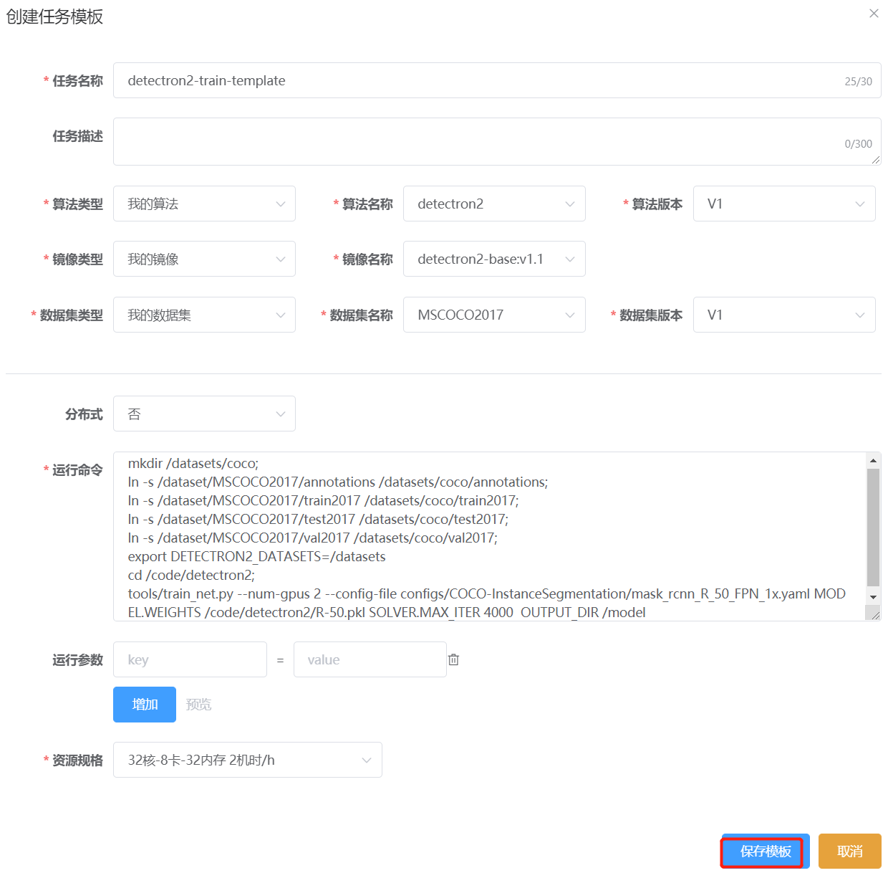

### 从任务模板创建训练任务

如下图所示，点击某个模板的【创建训练任务】操作，进入创建训练任务页面，可以修改相关信息，也可以不修改，然后点击【开始训练】，就可以创建一个训练任务。

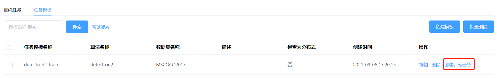


### 查看任务详情

点击训练任务的【详情】操作，可以查看任务简况、任务日志和任务负载情况。

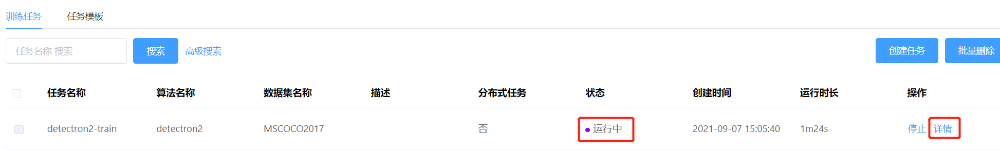

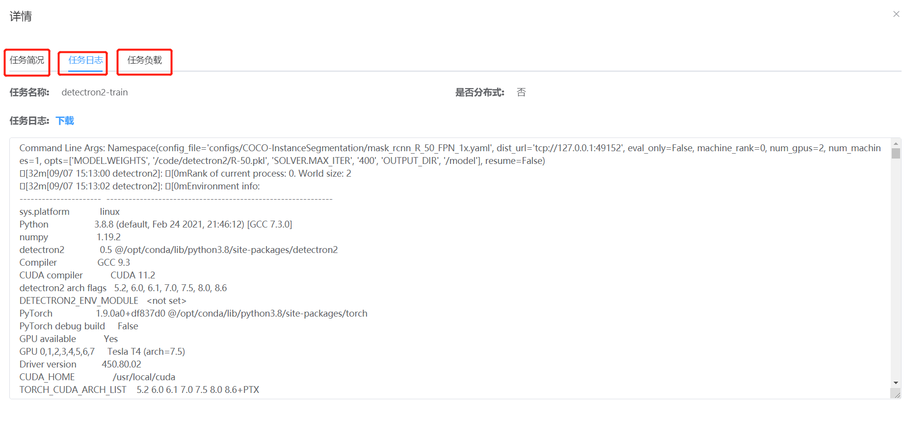

### 训练模型查看和下载

训练任务成功后，平台会将训练任务容器的/model目录下的模型文件输出到【我的模型】，如下图所示查看训练出来的模型。通过算法名称查找对应的模型。

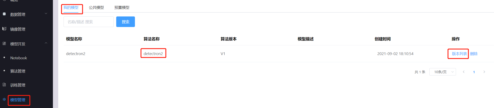


使用某算法版本每进行一次训练，就会产生一个版本的模型。点击某模型的【版本列表】操作，可以查看该算法版本对应的所有的模型版本。点击某版本的【预览】操作，可以预览模型文件，点击【下载】操作，可以下载该模型版本。

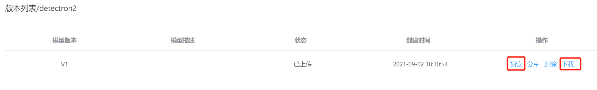


