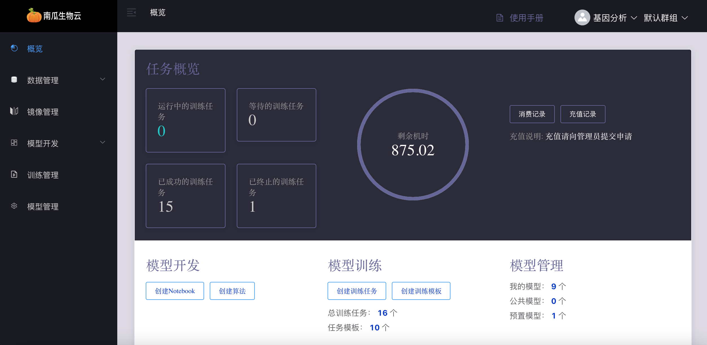

# 群组空间

群组空间是用户组私有工作空间的概念，群组空间支持让一批用户账号能共同访问一块隔离的资源，包括：数据，算法，模型，算力等，而不在该群组空间的用户账号无法访问到这些资源．

:::note
一个群组空间可以让多个用户账号加入，一个用户账号也可以加入多个群组空间，在当前群组空间下创建的数据，算法，模型，任务等只能在当前群组空间下可见．

系统默认有一个默认的群组空间，所有用户都属于默认群组空间．
:::

## 切换群组空间

用户可以通过右上角的群组操作栏切换群组空间．

